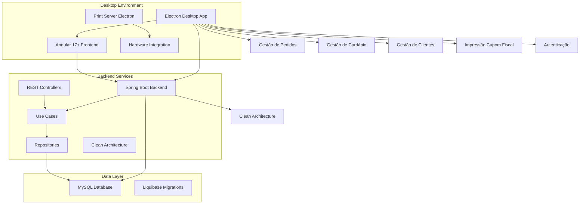
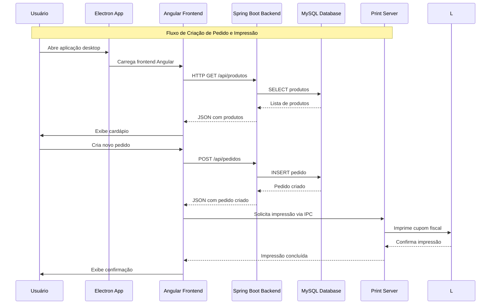
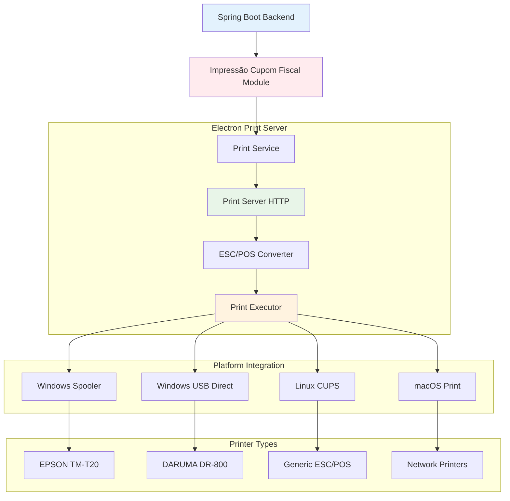

# 🍔 Experimenta AI - Soneca — Sistema Completo de Gestão para Lanchonetes

## 🚀 Visão Geral

O **Experimenta AI - Soneca** é uma solução completa e inovadora de gestão para lanchonetes, desenvolvida com arquitetura Clean Architecture seguindo princípios rigorosos de Clean Code. Esta plataforma desktop revoluciona a experiência de gestão de lanchonetes de balcão/local, oferecendo gestão completa de pedidos, cardápio, clientes, autenticação, impressão de cupons fiscais e muito mais, tudo integrado em uma aplicação desktop nativa com Electron.

### 🎯 Proposta de Valor

- **Sistema Completo de Gestão**: Solução end-to-end para lanchonetes de balcão/local
- **Arquitetura Maven Multi-Module**: Sistema modular com múltiplos módulos independentes seguindo Clean Architecture
- **Aplicação Desktop Nativa**: Electron para experiência desktop completa e integração com hardware
- **Impressão de Cupons Fiscais**: Sistema avançado de impressão ESC/POS com suporte a múltiplas impressoras
- **Interface Moderna**: Design responsivo com Angular 17+ (Standalone Components) e sintaxe moderna
- **Backend Enterprise**: Spring Boot 3.2+ modular com padrões enterprise e Clean Code
- **Containerização**: Docker Compose para desenvolvimento e deploy
- **Banco de Dados Robusto**: MySQL 8.0+ para persistência confiável com Liquibase para versionamento

## 🏗️ Arquitetura Geral do Sistema



### Fluxo Principal do Sistema

```text
1. Usuário abre aplicação Electron
2. Electron carrega frontend Angular 17+
3. Frontend conecta com backend Spring Boot via HTTP REST
4. Usuário faz login e autenticação via JWT
5. Sistema gerencia pedidos, cardápio, clientes
6. Impressão de cupons fiscais via Electron Print Server
7. Dados persistidos em MySQL com versionamento Liquibase
```

## 🔄 Arquitetura de Comunicação e Integração

### Sistema de Comunicação Electron ↔ Backend ↔ Frontend



### Sistema de Impressão Integrado



## 🏗️ Stack Tecnológica

### Backend (Spring Boot 3.2.12 + Java 17)

**Tecnologias Core:**

- **Java 17** (LTS) - Linguagem principal com recursos modernos
- **Spring Boot 3.2.12** - Framework enterprise líder de mercado
- **Spring Web** - APIs RESTful e arquitetura modular
- **Spring Data JPA** - ORM padrão da indústria com Hibernate
- **Spring Security** - Framework de segurança robusto (JWT)
- **Clean Architecture** - Separação rigorosa de camadas (Domain, Application, Infrastructure)

**Banco de Dados & Persistência:**

- **MySQL 8.0+** - Banco relacional enterprise
- **Liquibase 4.25.0** - Controle de versão de schema (padrão enterprise)
- **JPA/Hibernate** - ORM mais robusto do mercado Java
- **HikariCP** - Connection pool de alta performance

**Arquitetura & Design:**

- **Use Cases** - Lógica de negócio isolada e testável
- **Ports & Adapters** - Interfaces para integrações externas
- **DTOs** - Transferência de dados tipada e validada
- **Mappers** - Conversão de objetos com `MapperUtils` singleton
- **Value Objects** - Objetos imutáveis para regras de negócio

**Qualidade & Performance:**

- **Lombok 1.18.30** - Redução de boilerplate com `@RequiredArgsConstructor`
- **Maven 3.8+** - Gerenciamento de dependências multi-módulo
- **Bean Validation** - Validação de dados com JSR-303
- **Global Exception Handler** - Tratamento centralizado de erros

### Frontend (Angular 17.3+ + TypeScript 5.4+)

**Framework & Linguagem:**

- **Angular 17.3+** - Framework enterprise moderno
- **TypeScript 5.4+** - Tipagem estática para desenvolvimento escalável
- **RxJS 7.8** - Programação reativa (padrão enterprise)

**Sintaxe Moderna Obrigatória:**

- **`inject()`** - Injeção de dependência moderna (não constructor injection)
- **`signal()`** - Estado reativo com signals
- **`computed()`** - Propriedades calculadas reativas
- **`input()` e `output()`** - Nova sintaxe de inputs/outputs
- **Standalone Components** - Componentes independentes sem NgModules
- **`@if`, `@for`, `@switch`, `@defer`** - Nova sintaxe de controle de fluxo

**UI/UX & Estilização:**

- **CSS3/SCSS** - Estilos modernos e responsivos
- **Responsive Design** - Interface adaptável para diferentes dispositivos
- **Componentização** - Arquitetura baseada em componentes reutilizáveis
- **Chart.js 4.5+** - Visualizações de dados e relatórios

**Comunicação:**

- **HTTP Client** - Comunicação REST com backend
- **RxJS Observables** - Programação reativa para requisições
- **Interceptors** - Autenticação, tratamento de erros e logging
- **Guards** - Proteção de rotas com autenticação e autorização

### Desktop (Electron + Node.js)

**Plataforma Desktop:**

- **Electron** - Framework para aplicação desktop multiplataforma
- **Node.js Integration** - Acesso completo ao sistema operacional
- **IPC Communication** - Comunicação entre processos Electron

**Integração Nativa:**

- **Print Server** - Servidor HTTP local para receber comandos de impressão
- **Hardware Integration** - Acesso direto a impressoras USB e rede
- **File System API** - Gerenciamento local de dados e configurações
- **Platform Detection** - Suporte multiplataforma (Windows, Linux, macOS)

**Sistema de Impressão:**

- **ESC/POS Commands** - Protocolo padrão para impressoras térmicas
- **Multi-Platform Support** - Windows Spooler, USB Direct, Linux CUPS, macOS Print
- **Printer Detection** - Detecção automática de impressoras disponíveis
- **Print Queue Management** - Gerenciamento de fila de impressão

### Infraestrutura & DevOps

**Desenvolvimento:**

- **Maven 3.8+** - Build e gerenciamento de dependências (Multi-Module)
- **Angular CLI** - Ferramentas de desenvolvimento
- **Hot Reload** - Desenvolvimento ágil com recarregamento automático
- **Docker Compose** - Ambiente de desenvolvimento containerizado

**Deploy:**

- **Docker** - Containerização completa
- **Docker Compose** - Orquestração de containers
- **MySQL** - Banco de dados em produção
- **Environment Configuration** - Configuração via variáveis de ambiente
- **Google Cloud Run** - Deploy em cloud (opcional)

**Monitoramento & Observabilidade:**

- **Spring Boot Actuator** - Health checks e métricas
- **Structured Logging** - Logs estruturados para análise
- **Error Tracking** - Rastreamento de erros centralizado

## 📁 Estrutura do Projeto (Maven Multi-Module)

O sistema utiliza **Maven Multi-Module** com **Clean Architecture**, organizado em módulos funcionais independentes:

```text
sistema-lanchonete/
├── kernel-compartilhado/    # Kernel compartilhado (Value Objects, Exceptions, Utilitários)
├── gestao-pedidos/          # Gestão completa de pedidos (Lobby/Cozinha)
├── gestao-cardapio/         # Gestão de cardápio (produtos, categorias, itens)
├── gestao-clientes/         # Gestão de clientes (cadastro e histórico)
├── autenticacao/            # Módulo de autenticação e autorização (JWT)
├── impressao-cupom-fiscal/  # Impressão de cupons fiscais (ESC/POS)
├── sistema-orquestrador/    # Orquestrador principal (Spring Boot Application)
├── frontend/                # Frontend Angular 17+
│   └── electron/           # Configuração Electron e Print Server
└── docker/                  # Configurações Docker
```

## 🎯 Módulos Funcionais

### 1. Gestão de Pedidos (`gestao-pedidos`)

**Responsabilidades:**

- **Gestão Completa da Fila**: Controle de pedidos no lobby e cozinha
- **Status em Tempo Real**: Acompanhamento do ciclo de vida dos pedidos
- **Integração Lobby/Cozinha**: Comunicação entre áreas
- **Histórico Completo**: Registro de todos os pedidos
- **Múltiplos Meios de Pagamento**: PIX, Cartão, Dinheiro
- **Vinculação com Sessão de Trabalho**: Controle de turnos

**Entidades Principais:**

- `Pedido` - Entidade de domínio com regras de negócio
- `ItemPedido` - Itens do pedido com quantidade e preço
- `MeioPagamentoPedido` - Formas de pagamento do pedido
- `StatusPedido` - Enum com estados do pedido (PENDENTE, PREPARANDO, PRONTO, FINALIZADO)

**Use Cases:**

- `CriarPedidoUseCase` - Criação de novos pedidos
- `ListarPedidosUseCase` - Listagem de pedidos com filtros
- `AtualizarStatusPedidoUseCase` - Atualização de status
- `BuscarPedidoPorIdUseCase` - Busca de pedido específico

**Fluxo de Criação de Pedido:**

```text
1. Validação de produtos disponíveis
2. Cálculo automático de totais
3. Validação de meios de pagamento
4. Vinculação com sessão de trabalho ativa
5. Persistência no banco de dados
6. Retorno de DTO com pedido criado
```

### 2. Gestão de Cardápio (`gestao-cardapio`)

**Responsabilidades:**

- **CRUD Completo**: Produtos, categorias e itens
- **Categorização**: Sistema de categorias para organização
- **Preços e Promoções**: Gestão de valores e descontos
- **Controle de Disponibilidade**: Ativar/desativar produtos
- **Upload de Imagens**: Fotos dos produtos em base64

**Entidades Principais:**

- `Produto` - Entidade de domínio com regras de negócio
- `Categoria` - Categorias de produtos
- `Preco` - Value Object para valores monetários

**Use Cases:**

- `CriarProdutoUseCase` - Criação de novos produtos
- `ListarProdutosUseCase` - Listagem com filtros
- `AtualizarProdutoUseCase` - Atualização de produtos
- `BuscarProdutoPorIdUseCase` - Busca de produto específico
- `ListarCategoriasUseCase` - Listagem de categorias

**Características Técnicas:**

- Validação de preços e disponibilidade
- Suporte a imagens em base64 (LongText)
- Integração com módulo de pedidos via Ports

### 3. Gestão de Clientes (`gestao-clientes`)

**Responsabilidades:**

- **Cadastro Completo**: Dados pessoais e de contato
- **Histórico de Pedidos**: Rastreamento de todas as transações
- **Busca e Filtros**: Pesquisa avançada de clientes
- **Validação de Dados**: Validação de CPF, telefone, etc.

**Entidades Principais:**

- `Cliente` - Entidade de domínio com dados do cliente
- `HistoricoPedidos` - Histórico vinculado aos pedidos

**Use Cases:**

- `CriarClienteUseCase` - Criação de novos clientes
- `ListarClientesUseCase` - Listagem com filtros
- `AtualizarClienteUseCase` - Atualização de dados
- `BuscarClientePorIdUseCase` - Busca de cliente específico

### 4. Autenticação (`autenticacao`)

**Responsabilidades:**

- **Sistema de Login**: Autenticação de usuários
- **Autorização**: Controle de acesso por perfil (ADMINISTRADOR, OPERADOR)
- **JWT Tokens**: Autenticação stateless
- **Segurança**: Spring Security integrado
- **Gestão de Sessões**: Controle de sessões de trabalho

**Funcionalidades:**

- Login com usuário e senha
- Geração de JWT tokens
- Refresh tokens (opcional)
- Proteção de rotas com Guards
- Interceptors para autenticação automática

**Entidades Principais:**

- `Usuario` - Entidade de domínio com dados do usuário
- `SessaoTrabalho` - Controle de sessões de trabalho ativas

**Use Cases:**

- `AutenticarUsuarioUseCase` - Autenticação e geração de token
- `ValidarTokenUseCase` - Validação de tokens JWT
- `CriarSessaoTrabalhoUseCase` - Abertura de sessão de trabalho
- `FinalizarSessaoTrabalhoUseCase` - Fechamento de sessão

### 5. Impressão de Cupom Fiscal (`impressao-cupom-fiscal`)

**Responsabilidades:**

- **Geração de Cupons**: Impressão automática de cupons fiscais
- **Formatação Fiscal**: Layout conforme legislação
- **Integração com Impressoras**: Suporte a diferentes modelos (EPSON, DARUMA, genéricas)
- **Comunicação Electron**: Integração com Print Server do Electron

**Características Técnicas:**

- **Protocolo ESC/POS**: Comandos padrão para impressoras térmicas
- **Multi-Platform**: Suporte Windows, Linux, macOS
- **Print Server**: Servidor HTTP local no Electron
- **Detecção Automática**: Detecção de impressoras disponíveis
- **Configuração Flexível**: Suporte a múltiplas impressoras

**Fluxo de Impressão:**

```text
1. Backend gera dados do cupom fiscal
2. Backend envia comando de impressão para Print Server (HTTP)
3. Print Server recebe comando via IPC do Electron
4. Print Server converte dados para ESC/POS
5. Print Server envia para impressora (USB, Rede, Spooler)
6. Confirmação de impressão retornada ao backend
```

**Suporte a Impressoras:**

- **EPSON TM-T20**: Impressoras térmicas EPSON
- **DARUMA DR-800**: Impressoras DARUMA
- **Genéricas ESC/POS**: Qualquer impressora compatível com ESC/POS

### 6. Sistema Orquestrador (`sistema-orquestrador`)

**Responsabilidades:**

- **Aplicação Principal**: Spring Boot Application
- **Configuração Central**: Configurações globais (CORS, Database, Exception Handling)
- **Integração de Módulos**: Orquestração de todos os módulos
- **Adapters**: Implementação de Ports para comunicação entre módulos
- **Liquibase**: Gerenciamento de migrações de banco de dados

**Configurações Principais:**

- `CorsConfig` - Configuração de CORS para frontend
- `CloudSqlDataSourceConfig` - Configuração de datasource (Cloud SQL ou local)
- `LiquibaseConfig` - Configuração de migrações
- `GlobalExceptionHandler` - Tratamento centralizado de exceções
- `SpaFallbackConfig` - Fallback para SPA (Single Page Application)

## 🔧 Sistemas Técnicos de Destaque

### Clean Architecture Implementation

A implementação segue rigorosamente os princípios de Clean Architecture:

**Estrutura de Pacotes:**

```text
com.snackbar.{modulo}
├── domain/
│   ├── entities/          # Entidades de domínio
│   ├── valueobjects/      # Value Objects
│   └── services/          # Domain Services
├── application/
│   ├── usecases/          # Casos de uso
│   ├── dtos/              # Data Transfer Objects
│   └── ports/             # Interfaces (Ports)
└── infrastructure/
    ├── persistence/       # Repositories JPA
    ├── web/               # REST Controllers
    └── mappers/           # Mappers Domain ↔ Entity ↔ DTO
```

**Exemplo de Use Case:**

```java
@Service
@RequiredArgsConstructor
public class CriarPedidoUseCase {
    private final PedidoRepositoryPort repository;
    private final CardapioServicePort cardapioService;
    private final PedidoValidator validator;
    
    public PedidoDTO executar(CriarPedidoRequest request) {
        validarRequest(request);
        List<Produto> produtos = buscarProdutos(request.produtoIds());
        Pedido pedido = criarPedido(request, produtos);
        Pedido salvo = repository.salvar(pedido);
        return mapper.map(salvo, PedidoDTO.class);
    }
}
```

**Regras de Dependência:**

```text
Infrastructure → Application → Domain
```

- **Domain**: Não depende de frameworks (Spring, JPA, etc.)
- **Application**: Depende apenas de Domain, define Ports
- **Infrastructure**: Implementa Ports, pode usar frameworks

### Gestão de Estado com Signals

O frontend utiliza signals para gerenciamento de estado reativo:

**Exemplo de Componente:**

```typescript
@Component({
  selector: 'app-pedidos',
  standalone: true,
  imports: [CommonModule, FormsModule],
  templateUrl: './pedidos.component.html',
  changeDetection: ChangeDetectionStrategy.OnPush
})
export class PedidosComponent {
  private readonly pedidoService = inject(PedidoService);
  
  readonly pedidos = signal<Pedido[]>([]);
  readonly isLoading = signal<boolean>(false);
  readonly pedidosFiltrados = computed(() => 
    this.pedidos().filter(p => p.status === 'PENDENTE')
  );
  
  carregarPedidos() {
    this.isLoading.set(true);
    this.pedidoService.listar().subscribe({
      next: (pedidos) => {
        this.pedidos.set(pedidos);
        this.isLoading.set(false);
      }
    });
  }
}
```

**Benefícios:**

- Estado reativo automático
- Change Detection otimizado (OnPush)
- Código mais limpo e legível
- Melhor performance

### Sistema de Impressão ESC/POS

O sistema de impressão é uma das funcionalidades mais avançadas do projeto:

**Arquitetura do Sistema de Impressão:**

```text
Backend (Spring Boot)
  ↓ HTTP Request
Print Server (Electron)
  ↓ ESC/POS Conversion
Print Executor
  ↓ Platform-specific
Printer (USB/Network/Spooler)
```

**Características Técnicas:**

- **Print Server HTTP**: Servidor local no Electron para receber comandos
- **ESC/POS Converter**: Conversão de dados para comandos ESC/POS
- **Multi-Platform Support**: Windows Spooler, USB Direct, Linux CUPS, macOS Print
- **Printer Detection**: Detecção automática de impressoras disponíveis
- **Error Handling**: Tratamento robusto de erros de impressão

**Exemplo de Comando ESC/POS:**

```javascript
// Comandos ESC/POS para impressão
const ESC = '\x1B';
const GS = '\x1D';

// Centralizar texto
const center = ESC + 'a' + '\x01';

// Negrito
const bold = ESC + 'E' + '\x01';

// Cortar papel
const cut = GS + 'V' + '\x41' + '\x03';
```

### Sistema de Autenticação JWT

**Fluxo de Autenticação:**

```text
1. Usuário faz login (POST /api/auth/login)
2. Backend valida credenciais
3. Backend gera JWT token
4. Frontend armazena token
5. Interceptor adiciona token em requisições
6. Backend valida token em cada requisição
7. Guards protegem rotas no frontend
```

**Características:**

- **JWT Tokens**: Autenticação stateless
- **Interceptors**: Adição automática de token
- **Guards**: Proteção de rotas no frontend
- **Error Handling**: Redirecionamento automático em caso de token inválido

## 🛡️ Segurança e Validação

### Validação de Dados

**Backend:**

- **Bean Validation** - Validação com anotações JSR-303 (`@NotNull`, `@NotBlank`, `@Min`, etc.)
- **Custom Validators** - Validações específicas do negócio
- **Error Handling** - Tratamento robusto de erros com `GlobalExceptionHandler`
- **DTOs Validados** - Todos os DTOs validados antes de processamento

**Frontend:**

- **Angular Validators** - Validação em tempo real em formulários
- **Custom Validators** - Validações específicas do negócio
- **Error Handling** - Tratamento de erros de validação com mensagens claras
- **Form Controls** - `FormControl`, `FormGroup`, `FormArray` com validações

### Autenticação e Autorização

- **Spring Security** - Framework de segurança enterprise
- **JWT Tokens** - Autenticação stateless com expiração configurável
- **Role-based Access** - Controle de acesso por perfil (ADMINISTRADOR, OPERADOR)
- **Guards** - Proteção de rotas no frontend
- **Interceptors** - Autenticação automática em requisições HTTP

## 📊 Banco de Dados

### Estrutura Principal

**Entidades Core:**

- **Pedidos**: Pedidos com itens, status e meios de pagamento
- **Produtos**: Produtos com categorização, preços e imagens
- **Clientes**: Clientes com histórico de compras
- **Categorias**: Categorias de produtos
- **Usuários**: Usuários do sistema com perfis
- **Sessões de Trabalho**: Controle de sessões ativas
- **Configurações**: Configurações de animação e impressora

### Migrações

**Sistema Liquibase:**

- **Versionamento**: Controle de versão de schema com changelogs
- **Rollback**: Capacidade de reverter mudanças
- **Seed Data**: Dados iniciais para desenvolvimento
- **Estrutura Organizada**: Changelogs organizados por funcionalidade

**Exemplo de Changelog:**

```xml
<changeSet id="001-initial-schema" author="system">
    <createTable tableName="produtos">
        <column name="id" type="BIGINT" autoIncrement="true">
            <constraints primaryKey="true" nullable="false"/>
        </column>
        <column name="nome" type="VARCHAR(255)">
            <constraints nullable="false"/>
        </column>
        <!-- ... mais colunas ... -->
    </createTable>
</changeSet>
```

## 🚀 Deploy e Infraestrutura

### Ambientes

- **Desenvolvimento**: MySQL local ou Docker Compose
- **Produção**: MySQL em servidor dedicado ou cloud (Google Cloud SQL)

### Scripts de Deploy

**Executando com Docker Compose:**

```bash
# Subir containers (MySQL + Backend)
cd docker
docker-compose up -d

# Backend estará disponível em http://localhost:8080
```

**Executando Localmente:**

```bash
# Compilar todos os módulos
mvn clean install

# Executar aplicação
cd sistema-orquestrador
mvn spring-boot:run
```

**Build Completo:**

```bash
# Compilar todos os módulos Maven
mvn clean install

# Build do Frontend
cd frontend
npm install
npm run build

# Build do Electron (se aplicável)
cd electron
npm install
npm run build:electron
```

**Deploy em Cloud (Google Cloud Run):**

```bash
# Build da imagem Docker
docker build -t gcr.io/PROJECT_ID/snackbar-backend .

# Push para Google Container Registry
docker push gcr.io/PROJECT_ID/snackbar-backend

# Deploy no Cloud Run
gcloud run deploy snackbar-backend \
  --image gcr.io/PROJECT_ID/snackbar-backend \
  --platform managed \
  --region us-central1
```

## 📈 Métricas e Monitoramento

### Health Checks

- **Spring Boot Actuator**: Endpoints de saúde da aplicação (`/actuator/health`)
- **Database Status**: Verificação de conectividade com MySQL
- **Configuration Status**: Verificação de configuração

### Logs

- **Structured Logging**: Logs estruturados para análise
- **Error Tracking**: Rastreamento de erros centralizado
- **Request Logging**: Log de requisições para debugging
- **Log Levels**: Configuração de níveis de log por ambiente

## 🎨 Interface do Usuário

### Design

- **Layout Moderno**: Interface limpa e profissional
- **Cores Apropriadas**: Paleta de cores para ambiente de lanchonete
- **Tipografia Clara**: Fonte legível e hierarquia visual
- **Responsividade**: Adaptação para diferentes tamanhos de tela
- **Animações Suaves**: Feedback visual para ações do usuário

### Componentes Principais

- **Dashboard (Home)**: Visão geral com módulos disponíveis
- **Gestão de Pedidos**: Interface de criação e acompanhamento
- **Gestão de Cardápio**: CRUD completo de produtos
- **Gestão de Clientes**: Cadastro e histórico
- **Login**: Autenticação de usuários
- **Relatórios**: Visualização de dados e analytics (quando implementado)

### Tecnologias de UI

- **Angular Material** (opcional): Componentes UI consistentes
- **Chart.js**: Visualizações de dados para relatórios
- **CSS3/SCSS**: Estilos modernos e responsivos
- **Standalone Components**: Arquitetura sem NgModules

## 🔮 Inovações Técnicas & Diferenciais Competitivos

### 1. Clean Architecture Completa

**Implementação rigorosa** dos princípios de Clean Architecture:

- **Separação Total**: Domain não depende de frameworks
- **Testabilidade**: Use cases testáveis sem dependências externas
- **Flexibilidade**: Fácil adição de novas funcionalidades
- **Manutenibilidade**: Código organizado e fácil de entender
- **Ports & Adapters**: Comunicação entre módulos via interfaces

### 2. Sintaxe Angular 17+ Moderna

**Uso obrigatório** de todas as práticas modernas:

- **`inject()`**: Injeção de dependência moderna (não constructor injection)
- **`signal()`**: Estado reativo eficiente
- **`computed()`**: Propriedades calculadas reativas
- **Standalone Components**: Arquitetura sem NgModules
- **Nova Sintaxe**: `@if`, `@for`, `@switch` ao invés de diretivas antigas
- **Change Detection OnPush**: Otimização de performance

### 3. Sistema Modular Maven Multi-Module

**Arquitetura modular** para escalabilidade:

- **Módulos Independentes**: Cada funcionalidade isolada
- **Reutilização**: Componentes e serviços reutilizáveis
- **Testabilidade**: Testes unitários facilitados
- **Manutenibilidade**: Fácil manutenção e evolução
- **Kernel Compartilhado**: Value Objects e utilitários compartilhados

### 4. Sistema de Impressão ESC/POS Avançado

**Solução inovadora** de impressão integrada:

- **Print Server Electron**: Servidor HTTP local para receber comandos
- **Multi-Platform**: Suporte Windows, Linux, macOS
- **Multi-Printer**: Suporte a múltiplas impressoras (EPSON, DARUMA, genéricas)
- **ESC/POS Protocol**: Protocolo padrão para impressoras térmicas
- **Detecção Automática**: Detecção automática de impressoras disponíveis
- **Error Handling**: Tratamento robusto de erros de impressão

### 5. Integração Desktop Nativa com Electron

**Solução híbrida** combinando web e desktop:

- **Electron Desktop**: Aplicação nativa com acesso ao hardware
- **Angular Frontend**: Interface web moderna e responsiva
- **Print Server**: Integração nativa com impressoras
- **Hardware Access**: Acesso completo ao sistema operacional
- **Cross-Platform**: Compatibilidade Windows, Linux, macOS

### 6. Sistema de Autenticação JWT

**Autenticação moderna** e segura:

- **JWT Tokens**: Autenticação stateless
- **Interceptors**: Autenticação automática em requisições
- **Guards**: Proteção de rotas no frontend
- **Role-based Access**: Controle de acesso por perfil
- **Error Handling**: Redirecionamento automático em caso de token inválido

## 🛠️ Skills Técnicas Demonstradas

### Backend Development (Enterprise)

- **Java 17 + Spring Boot 3.2.12** - Stack enterprise moderna
- **Clean Architecture** - Arquitetura limpa e testável
- **Use Cases** - Lógica de negócio isolada
- **RESTful APIs** - Arquitetura de comunicação padrão
- **MySQL 8.0+** - Banco relacional enterprise
- **Liquibase 4.25.0** - Controle de versão de banco de dados
- **JWT Authentication** - Autenticação stateless
- **Maven Multi-Module** - Gerenciamento de dependências modular

### Frontend Development (Modern)

- **Angular 17.3+** - Framework enterprise moderno
- **TypeScript 5.4+** - Tipagem estática
- **Signals** - Estado reativo moderno
- **Standalone Components** - Arquitetura sem módulos
- **RxJS 7.8** - Programação reativa
- **Responsive Design** - Interface adaptável
- **Chart.js** - Visualizações de dados

### Desktop Development

- **Electron** - Framework para apps desktop multiplataforma
- **Node.js Integration** - Acesso completo ao sistema operacional
- **IPC Communication** - Comunicação entre processos
- **Print Server** - Servidor HTTP local para impressão
- **Hardware Integration** - Acesso direto a impressoras

### Arquitetura & Design

- **Clean Architecture** - Separação de responsabilidades
- **SOLID Principles** - Princípios de design
- **Domain-Driven Design** - Design orientado a domínio
- **Dependency Inversion** - Inversão de dependências
- **Ports & Adapters** - Padrão de arquitetura

### DevOps & Infrastructure

- **Docker** - Containerização
- **Docker Compose** - Orquestração de containers
- **Maven** - Build e gerenciamento de dependências
- **Liquibase** - Migrações de banco de dados
- **Google Cloud Run** - Deploy em cloud (opcional)

## 📊 Impacto & Resultados

### Inovações Implementadas

1. **Clean Architecture completa** com separação rigorosa de camadas
2. **Sintaxe Angular 17+ moderna** em todos os componentes
3. **Sistema modular Maven Multi-Module** para escalabilidade
4. **Gestão completa** de pedidos, produtos, clientes e autenticação
5. **Sistema de impressão ESC/POS** integrado com Electron
6. **Aplicação desktop nativa** com integração de hardware

### Tecnologias Enterprise Utilizadas

- **Java 17 + Spring Boot 3.2.12** - Stack enterprise líder
- **Angular 17.3 + TypeScript 5.4** - Framework frontend moderno
- **MySQL 8.0+** - Banco relacional robusto
- **Clean Architecture** - Arquitetura limpa e testável
- **Electron** - Framework desktop multiplataforma
- **Liquibase** - Versionamento de banco de dados

### Diferenciais Competitivos

- **Arquitetura Limpa**: Código organizado e testável
- **Sintaxe Moderna**: Uso de todas as práticas modernas do Angular
- **Sistema Completo**: Solução end-to-end para lanchonetes
- **Escalabilidade**: Arquitetura preparada para crescimento
- **Experiência Desktop**: Interface nativa com integração de hardware
- **Impressão Integrada**: Sistema de impressão ESC/POS avançado

## 📝 Conclusão

Este projeto demonstra **expertise avançada** em:

### Arquitetura & Design Aplicados

- **Clean Architecture** com separação rigorosa de camadas
- **SOLID Principles** aplicados consistentemente
- **Domain-Driven Design** para modelagem de negócio
- **Use Cases** para lógica de negócio isolada
- **Ports & Adapters** para comunicação entre módulos

### Tecnologias Modernas

- **Java 17 + Spring Boot 3.2.12** - Stack enterprise moderna
- **Angular 17.3 + TypeScript 5.4** - Framework frontend moderno
- **Signals e Standalone Components** - Práticas mais recentes
- **MySQL 8.0+ + Liquibase 4.25.0** - Banco de dados com versionamento
- **Electron** - Aplicação desktop multiplataforma

### Qualidade & Boas Práticas

- **Clean Code** - Código limpo e legível
- **Testabilidade** - Arquitetura preparada para testes
- **Manutenibilidade** - Código fácil de manter e evoluir
- **Documentation** - Documentação clara e completa
- **DRY** - Reutilização de código com kernel compartilhado

O **Experimenta AI - Soneca** representa uma **solução enterprise completa** que combina tecnologias modernas com práticas de Clean Architecture, demonstrando capacidade de criar sistemas robustos, escaláveis e fáceis de manter para gestão de lanchonetes, com integração nativa de hardware e experiência desktop premium.

---

## Desenvolvido com ❤️ seguindo Clean Architecture e Clean Code

Sistema completo de gestão desenvolvido com arquitetura limpa e tecnologias enterprise modernas.
