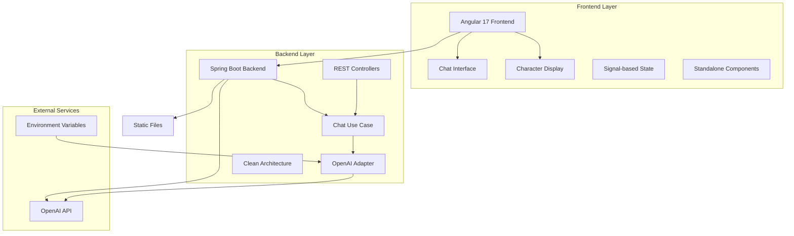
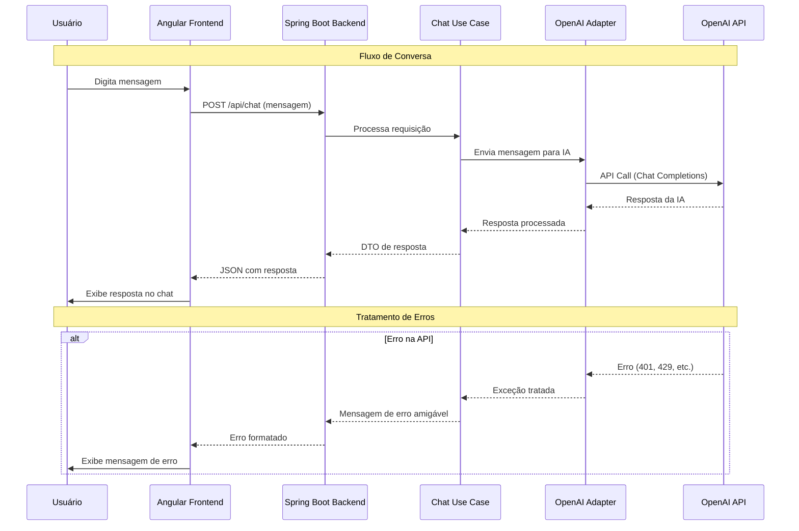

# 🤖 Obaid with Bro — Chat Interativo com Inteligência Artificial

## 🚀 Visão Geral

O **Obaid with Bro** (também conhecido como **Diabo Chat**) é uma aplicação web moderna de chat interativo com inteligência artificial, desenvolvida com arquitetura Clean Architecture seguindo princípios de Clean Code. A solução combina um backend robusto em Spring Boot com frontend moderno em Angular, oferecendo uma experiência de conversação fluida e natural com IA através de uma interface intuitiva e responsiva.

### 🎯 Proposta de Valor

- **Chat com IA Avançado**: Integração com OpenAI GPT para conversas naturais e contextuais
- **Arquitetura Limpa**: Clean Architecture com separação clara de responsabilidades
- **Interface Moderna**: Design responsivo com Angular 17+ e sintaxe moderna
- **Backend Enterprise**: Spring Boot com padrões enterprise e Clean Code
- **Integração Flexível**: Adapter pattern para múltiplos provedores de IA

## 🏗️ Arquitetura Geral do Sistema



### Fluxo de Comunicação



## 🏗️ Stack Tecnológica

### Backend (Spring Boot 3.2.3 + Java 17)

**Tecnologias Core:**

- **Java 17** - Linguagem principal (LTS)
- **Spring Boot 3.2.3** - Framework enterprise líder de mercado
- **Spring Web** - APIs RESTful e arquitetura de microserviços
- **Spring Boot DevTools** - Hot reload e desenvolvimento ágil
- **Clean Architecture** - Separação de camadas (Domain, Application, Infrastructure)

**Arquitetura & Design:**

- **Use Cases** - Lógica de negócio isolada
- **Ports & Adapters** - Interfaces para integrações externas
- **DTOs** - Transferência de dados tipada
- **Mappers** - Conversão de objetos (se necessário)

**Integração & APIs:**

- **OpenAI API** - Integração com GPT para chat
- **REST Controllers** - Endpoints para comunicação frontend
- **Environment Variables** - Configuração segura de chaves API

**Qualidade & Performance:**

- **Lombok** - Redução de boilerplate
- **Maven** - Gerenciamento de dependências
- **Spring Boot Actuator** - Health checks e métricas

### Frontend (Angular 17.3.0 + TypeScript)

**Framework & Linguagem:**

- **Angular 17.3.0** - Framework enterprise moderno
- **TypeScript 5.4.2** - Tipagem estática para desenvolvimento escalável
- **RxJS 7.8.0** - Programação reativa (padrão enterprise)

**Sintaxe Moderna Obrigatória:**

- **`inject()`** - Injeção de dependência moderna (não constructor injection)
- **`signal()`** - Estado reativo com signals
- **`computed()`** - Propriedades calculadas
- **`input()` e `output()`** - Nova sintaxe de inputs/outputs
- **Standalone Components** - Componentes independentes sem NgModules

**UI/UX & Estilização:**

- **CSS3** - Estilos modernos e responsivos
- **Responsive Design** - Interface adaptável para diferentes dispositivos
- **Componentização** - Arquitetura baseada em componentes reutilizáveis

**Comunicação:**

- **HTTP Client** - Comunicação REST com backend
- **RxJS Observables** - Programação reativa para requisições

### Infraestrutura & DevOps

**Desenvolvimento:**

- **Maven** - Build e gerenciamento de dependências
- **Angular CLI** - Ferramentas de desenvolvimento
- **Hot Reload** - Desenvolvimento ágil com Spring Boot DevTools

**Deploy:**

- **Static Files Integration** - Backend serve frontend compilado
- **Multi-stage Build** - Otimização de builds de produção
- **Environment Configuration** - Configuração via variáveis de ambiente

## 🎯 Principais Funcionalidades

### 1. Sistema de Chat com IA

- **Conversação Natural**: Integração com OpenAI GPT para respostas contextuais
- **Interface Intuitiva**: Chat moderno com exibição de mensagens em tempo real
- **Tratamento de Erros**: Mensagens amigáveis quando a API não está configurada
- **Configuração Flexível**: Suporte a múltiplos provedores via adapter pattern

#### Fluxo do Chat

```text
1. Usuário digita mensagem → Frontend captura input
2. Requisição HTTP → Backend recebe mensagem
3. Use Case processa → Lógica de negócio isolada
4. Adapter chama IA → Integração com OpenAI
5. Resposta processada → DTO retornado
6. Frontend exibe → Interface atualizada com resposta
```

### 2. Arquitetura Clean Architecture

- **Separação de Camadas**: Domain, Application e Infrastructure bem definidas
- **Use Cases**: Lógica de negócio isolada e testável
- **Ports & Adapters**: Interfaces para integrações externas
- **Dependency Inversion**: Dependências apontam para abstrações

#### Estrutura de Camadas

```text
Domain (Núcleo)
  └─ Entidades, Value Objects, Regras de Negócio
  └─ ❌ NUNCA depende de frameworks

Application (Casos de Uso)
  └─ Use Cases, DTOs, Ports (Interfaces)
  └─ ✅ Depende apenas de Domain

Infrastructure (Adaptadores)
  └─ Controllers, Adapters, Configurações
  └─ ✅ Implementa interfaces de Application
  └─ ✅ Pode usar Spring, APIs externas, etc.
```

### 3. Integração com OpenAI

- **Adapter Pattern**: Implementação flexível para múltiplos provedores
- **Configuração Segura**: Chaves API via variáveis de ambiente
- **Tratamento de Erros**: Mensagens claras quando serviço não está disponível
- **Chat Completions**: Integração com endpoint oficial da OpenAI

#### Fluxo de Integração

```text
1. Adapter recebe mensagem → Validação de configuração
2. Verifica API Key → Variável de ambiente ou propriedade JVM
3. Chama OpenAI API → Endpoint de Chat Completions
4. Processa resposta → Extração de conteúdo da IA
5. Retorna DTO → Resposta formatada para frontend
```

### 4. Interface Moderna Angular

- **Standalone Components**: Arquitetura moderna sem NgModules
- **Signals**: Estado reativo com `signal()` e `computed()`
- **Injeção Moderna**: Uso de `inject()` ao invés de constructor injection
- **Sintaxe Moderna**: Nova sintaxe `@if`, `@for` do Angular 17+

#### Características da Interface

- **Exibição de Personagem**: Figura central representando o "diabo"
- **Chat Interativo**: Área de mensagens com scroll automático
- **Input de Mensagens**: Campo de texto com envio via Enter ou botão
- **Feedback Visual**: Indicadores de carregamento e estados

## 🔧 Sistemas Técnicos de Destaque

### Clean Architecture Implementation

A implementação segue rigorosamente os princípios de Clean Architecture:

**Estrutura de Pacotes:**

```text
com.obaidwithbro
├── domain/
│   └── entities/          # Entidades de domínio (se necessário)
├── application/
│   ├── usecases/          # Casos de uso (ChatUseCase)
│   ├── dtos/              # Data Transfer Objects
│   └── ports/             # Interfaces (ChatPort, AIProviderPort)
└── infrastructure/
    ├── adapters/          # Implementações (OpenAIAdapter)
    ├── controllers/       # REST Controllers
    └── config/            # Configurações Spring
```

**Exemplo de Use Case:**

```java
@Service
@RequiredArgsConstructor
public class ChatUseCase {
    private final ChatPort chatPort;
    
    public ChatResponseDTO processMessage(ChatRequestDTO request) {
        // Lógica de negócio isolada
        String response = chatPort.sendMessage(request.getMessage());
        return new ChatResponseDTO(response);
    }
}
```

**Exemplo de Adapter:**

```java
@Component
@RequiredArgsConstructor
public class OpenAIAdapter implements ChatPort {
    private final String apiKey;
    
    @Override
    public String sendMessage(String message) {
        // Integração com OpenAI API
        // Retorna resposta da IA
    }
}
```

### Integração OpenAI com Tratamento de Erros

O sistema de integração com OpenAI é robusto e trata diversos cenários:

**Configuração Segura:**

```java
// Leitura de API Key de variáveis de ambiente
@Value("${openai.api.key:${OPENAI_API_KEY:}}")
private String apiKey;
```

**Tratamento de Erros:**

- **API Key não configurada**: Mensagem amigável informando necessidade de configuração
- **Erro 401 (Unauthorized)**: Chave inválida ou expirada
- **Erro 429 (Rate Limit)**: Limite de requisições excedido
- **Erro 500 (Server Error)**: Problema no servidor da OpenAI
- **Timeout**: Requisição demorou muito para responder

### Frontend com Angular Moderno

O frontend utiliza todas as práticas modernas do Angular 17+:

**Componente Standalone:**

```typescript
@Component({
  selector: 'app-chat',
  standalone: true,
  imports: [CommonModule, FormsModule],
  templateUrl: './chat.component.html',
  styleUrl: './chat.component.css'
})
export class ChatComponent {
  private readonly chatService = inject(ChatService);
  
  readonly messages = signal<Message[]>([]);
  readonly isLoading = signal<boolean>(false);
  
  sendMessage(text: string) {
    this.isLoading.set(true);
    this.chatService.sendMessage(text).subscribe({
      next: (response) => {
        this.messages.update(msgs => [...msgs, response]);
        this.isLoading.set(false);
      },
      error: (error) => {
        // Tratamento de erro
        this.isLoading.set(false);
      }
    });
  }
}
```

**Sintaxe Moderna no Template:**

```html
@if (isLoading()) {
  <div class="loading">Processando...</div>
}

@for (message of messages(); track message.id) {
  <div class="message">{{ message.text }}</div>
}
```

## 🛡️ Segurança e Configuração

### Gerenciamento de API Keys

**Boas Práticas Implementadas:**

- ✅ **Variáveis de Ambiente**: Chaves nunca commitadas no código
- ✅ **Fallback Configurável**: Suporte a propriedades JVM (apenas desenvolvimento)
- ✅ **Validação de Configuração**: Verificação se API key está presente
- ✅ **Mensagens Claras**: Feedback quando serviço não está configurado

**Configuração Recomendada:**

```bash
# Linux/macOS
export OPENAI_API_KEY="sk-..."

# Windows PowerShell
$env:OPENAI_API_KEY="sk-..."

# Windows CMD
set OPENAI_API_KEY=sk-...
```

### CORS e Segurança

- **CORS Configuration**: Configuração adequada para desenvolvimento e produção
- **Input Validation**: Validação de dados de entrada
- **Error Handling**: Tratamento seguro de erros sem expor detalhes internos

## 📊 Estrutura de Dados

### DTOs de Comunicação

**ChatRequestDTO:**

```java
public record ChatRequestDTO(
    String message
) {}
```

**ChatResponseDTO:**

```java
public record ChatResponseDTO(
    String response,
    String error
) {}
```

### Modelos Frontend

**Message Interface:**

```typescript
interface Message {
  id: string;
  text: string;
  sender: 'user' | 'ai';
  timestamp: Date;
}
```

## 🚀 Deploy e Infraestrutura

### Ambientes

- **Desenvolvimento**: Backend e frontend rodando separadamente
- **Produção**: Backend serve frontend compilado como arquivos estáticos

### Scripts de Deploy

**Desenvolvimento Rápido:**

```bash
# Frontend
cd frontend
npm install
npm start  # http://localhost:4200

# Backend (em outro terminal)
cd backend
mvn spring-boot:run  # http://localhost:8080
```

**Build de Produção:**

```bash
# 1. Build do frontend
cd frontend
npm run build --configuration=production

# 2. Copiar para backend (opcional - backend busca em ../frontend/dist)
cp -r dist/* ../backend/src/main/resources/static/

# 3. Build e executar backend
cd ../backend
mvn clean package
java -jar target/obaid-with-bro-backend-0.1.0.jar
```

**Configuração de Caminho do Frontend:**

O backend busca arquivos estáticos em:
1. `../frontend/dist/` (desenvolvimento)
2. `classpath:/static` (produção)

Você pode configurar via propriedade JVM:
```bash
-Dfrontend.path=/caminho/absoluto/para/dist
```

## 📈 Métricas e Monitoramento

### Health Checks

- **Spring Boot Actuator**: Endpoints de saúde da aplicação
- **API Status**: Verificação de conectividade com OpenAI
- **Configuration Status**: Verificação de configuração de API keys

### Logs

- **Structured Logging**: Logs estruturados para análise
- **Error Tracking**: Rastreamento de erros de integração
- **Request Logging**: Log de requisições para debugging

## 🎨 Interface do Usuário

### Design

- **Layout Centralizado**: Personagem central com chat ao redor
- **Cores Modernas**: Paleta de cores profissional
- **Tipografia Clara**: Fonte legível e hierarquia visual
- **Responsividade**: Adaptação para diferentes tamanhos de tela

### Componentes Principais

- **Character Display**: Exibição visual do personagem "diabo"
- **Chat Interface**: Área de mensagens com scroll automático
- **Input Field**: Campo de texto com validação
- **Send Button**: Botão de envio com feedback visual
- **Loading Indicator**: Indicador de carregamento durante processamento

## 🔮 Inovações Técnicas & Diferenciais Competitivos

### 1. Clean Architecture Completa

**Implementação rigorosa** dos princípios de Clean Architecture:

- **Separação Total**: Domain não depende de frameworks
- **Testabilidade**: Use cases testáveis sem dependências externas
- **Flexibilidade**: Fácil troca de adapters (OpenAI, Azure, etc.)
- **Manutenibilidade**: Código organizado e fácil de entender

### 2. Sintaxe Angular 17+ Moderna

**Uso obrigatório** de todas as práticas modernas:

- **`inject()`**: Injeção de dependência moderna
- **`signal()`**: Estado reativo eficiente
- **Standalone Components**: Arquitetura sem NgModules
- **Nova Sintaxe**: `@if`, `@for` ao invés de diretivas antigas

### 3. Adapter Pattern para IA

**Flexibilidade** para múltiplos provedores:

- **Interface Unificada**: `ChatPort` para qualquer provedor
- **Implementações Específicas**: `OpenAIAdapter`, `AzureAdapter`, etc.
- **Configuração Dinâmica**: Troca de provedor sem alterar use cases
- **Testabilidade**: Mocks fáceis para testes

### 4. Integração Segura com APIs Externas

**Boas práticas** de segurança e configuração:

- **Environment Variables**: Chaves nunca no código
- **Error Handling**: Tratamento robusto de erros
- **Rate Limiting**: Preparado para limites de API
- **Timeout Handling**: Tratamento de timeouts

## 🛠️ Skills Técnicas Demonstradas

### Backend Development (Enterprise)

- **Java 17 + Spring Boot 3.2.3** - Stack enterprise moderna
- **Clean Architecture** - Arquitetura limpa e testável
- **Use Cases** - Lógica de negócio isolada
- **Adapter Pattern** - Integração flexível com APIs externas
- **RESTful APIs** - Arquitetura de comunicação padrão
- **Environment Configuration** - Configuração segura

### Frontend Development (Modern)

- **Angular 17.3.0** - Framework enterprise moderno
- **TypeScript 5.4.2** - Tipagem estática
- **Signals** - Estado reativo moderno
- **Standalone Components** - Arquitetura sem módulos
- **RxJS** - Programação reativa
- **Responsive Design** - Interface adaptável

### Integração & APIs

- **OpenAI API** - Integração com GPT
- **REST APIs** - Comunicação frontend-backend
- **Error Handling** - Tratamento robusto de erros
- **Environment Variables** - Configuração segura

### Arquitetura & Design

- **Clean Architecture** - Separação de responsabilidades
- **SOLID Principles** - Princípios de design
- **Adapter Pattern** - Padrão de design para integrações
- **Dependency Inversion** - Inversão de dependências

## 📊 Impacto & Resultados

### Inovações Implementadas

1. **Clean Architecture completa** com separação rigorosa de camadas
2. **Sintaxe Angular 17+ moderna** em todos os componentes
3. **Adapter pattern** para integração flexível com IA
4. **Configuração segura** de API keys via environment variables
5. **Tratamento robusto** de erros e edge cases

### Tecnologias Enterprise Utilizadas

- **Java 17 + Spring Boot** - Stack enterprise líder
- **Angular 17 + TypeScript** - Framework frontend moderno
- **Clean Architecture** - Arquitetura limpa e testável
- **OpenAI API** - Integração com IA de ponta

### Diferenciais Competitivos

- **Arquitetura Limpa**: Código organizado e testável
- **Sintaxe Moderna**: Uso de todas as práticas modernas do Angular
- **Flexibilidade**: Fácil troca de provedores de IA
- **Segurança**: Configuração segura de chaves API
- **Experiência**: Interface intuitiva e responsiva

## 📝 Conclusão

Este projeto demonstra **expertise avançada** em:

### Arquitetura & Design

- **Clean Architecture** com separação rigorosa de camadas
- **SOLID Principles** aplicados consistentemente
- **Adapter Pattern** para integrações flexíveis
- **Use Cases** para lógica de negócio isolada

### Tecnologias Modernas

- **Java 17 + Spring Boot** - Stack enterprise moderna
- **Angular 17 + TypeScript** - Framework frontend moderno
- **Signals e Standalone Components** - Práticas mais recentes
- **OpenAI Integration** - Integração com IA de ponta

### Qualidade & Boas Práticas

- **Clean Code** - Código limpo e legível
- **Environment Configuration** - Configuração segura
- **Error Handling** - Tratamento robusto de erros
- **Documentation** - Documentação clara e completa

O **Obaid with Bro** representa uma **solução moderna e bem arquitetada** que combina tecnologias enterprise com práticas de Clean Architecture, demonstrando capacidade de criar sistemas limpos, testáveis e fáceis de manter, além de integrar com APIs externas de forma segura e flexível.

---

## 🚀 Próximos Passos Sugeridos

### Melhorias Futuras

- 🔄 **Autenticação**: Sistema de login e autorização
- 🔄 **Histórico de Conversas**: Persistência de mensagens
- 🔄 **Múltiplos Provedores**: Suporte a Azure, Anthropic, etc.
- 🔄 **Streaming de Respostas**: Respostas em tempo real via Server-Sent Events
- 🔄 **Testes Unitários**: Cobertura completa de testes
- 🔄 **CI/CD Pipeline**: Deploy automatizado

### Expansões Possíveis

- 📱 **PWA**: Transformar em Progressive Web App
- 🔔 **Notificações**: Sistema de notificações push
- 👥 **Chat em Grupo**: Conversas com múltiplos participantes
- 🎨 **Temas**: Suporte a temas claro/escuro
- 🌐 **Internacionalização**: Suporte a múltiplos idiomas

---

## Desenvolvido com ❤️ seguindo Clean Architecture e Clean Code

Projeto desenvolvido como scaffold inicial para aplicações modernas com integração de IA, demonstrando boas práticas de arquitetura e desenvolvimento.
