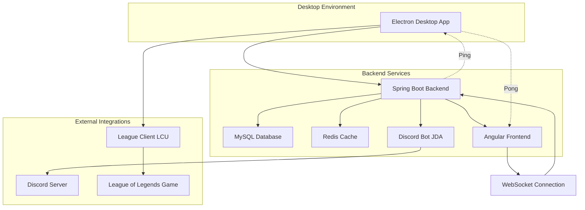
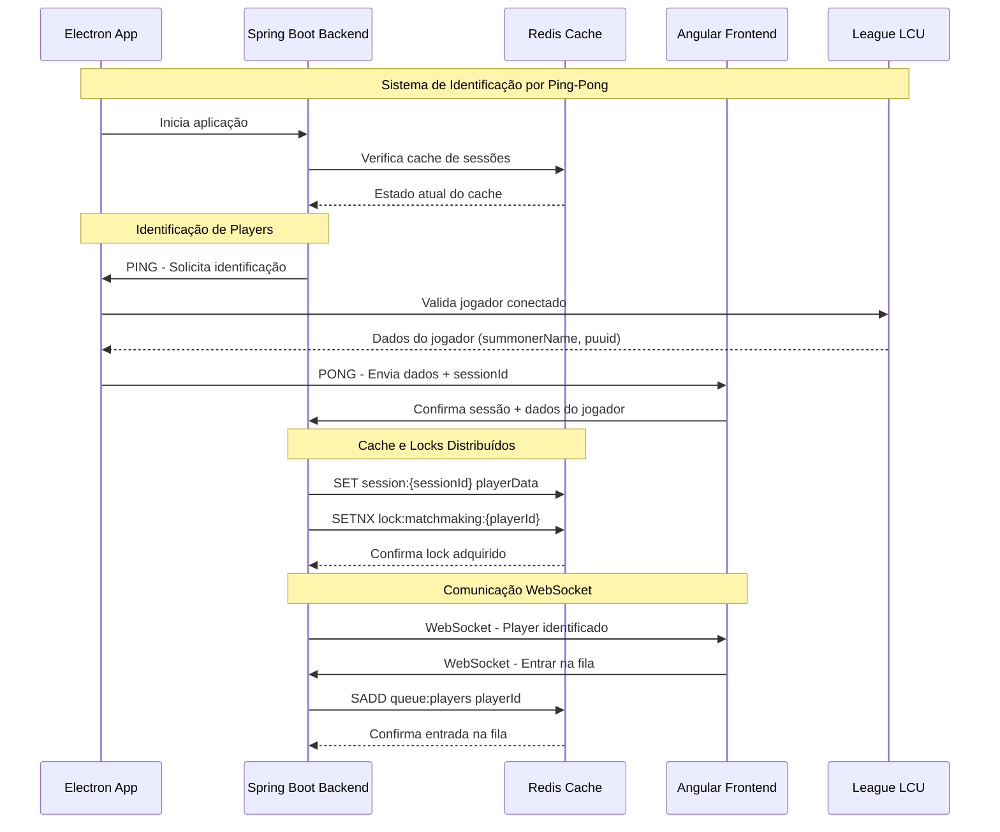
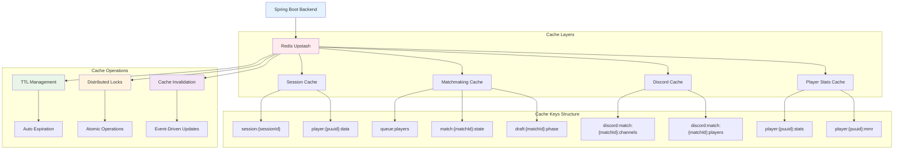

# 🎮 LOL Matchmaking System - Plataforma Avançada de Matchmaking

## 🚀 Visão Geral

O **LOL Matchmaking System** é uma solução completa e inovadora de matchmaking personalizado para League of Legends, desenvolvida com arquitetura moderna e tecnologias enterprise. Esta plataforma desktop revoluciona a experiência de criação de partidas customizadas, oferecendo drafts completos, integração nativa com o jogo via LCU (League Client Update) e automação avançada do Discord.

### 🎯 Proposta de Valor

- **Sistema de Matchmaking Inteligente**: Algoritmo proprietário de balanceamento baseado em MMR
- **Integração Nativa com LoL**: Validação em tempo real via League Client Update
- **Automação Discord Completa**: Gestão automática de canais, permissões e espectadores
- **Backend Centralizado**: Arquitetura robusta com possibilidade de múltiplas instâncias para escalabilidade
- **Experiência Desktop Premium**: Aplicação nativa com Electron e TypeScript

## 🏗️ Arquitetura Geral do Sistema



### Fluxo Principal do Sistema

```text
1. Usuário abre aplicação Electron
2. Electron inicia backend Spring Boot
3. Frontend Angular conecta via WebSocket
4. Usuário faz login e entra na fila
5. Sistema forma partidas via algoritmo de matchmaking
6. Draft é executado com validação LCU
7. Partida é monitorada em tempo real
8. Resultado é capturado e votado
9. Estatísticas são atualizadas
```

## 🔄 Arquitetura de Comunicação e Cache

### Sistema de Comunicação Electron ↔ Backend ↔ Frontend



### Sistema de Cache e Invalidação com Redis



### Backend (Spring Boot 3.3.2 + Java 21)

**Tecnologias Core:**

- **Java 21** com Spring Boot 3.3.2 (LTS) - Framework enterprise mais utilizado no mercado
- **Spring Data JPA** + **Hibernate** - ORM padrão da indústria para persistência
- **Spring Security** - Framework de segurança mais robusto do ecossistema Java
- **Spring Web** + **RESTful APIs** - Arquitetura de microserviços moderna

**Banco de Dados & Cache:**

- **MySQL 8.0** (Produção) + **H2** (Desenvolvimento) - Bancos relacionais enterprise
- **Redis Upstash** - Cache distribuído cloud-native e gerenciamento de estado em tempo real
- **Liquibase** - Controle de versão de schema (padrão enterprise)
- **Redisson** - Distributed locks para operações atômicas

**Integração & Comunicação:**

- **WebSockets** + **Socket.IO** - Comunicação bidirecional em tempo real
- **JDA (Java Discord API)** - Integração nativa com Discord
- **LCU Integration** - API nativa do League of Legends Client

**Qualidade & Performance:**

- **MapStruct** - Mapeamento de objetos type-safe
- **Lombok** - Redução de boilerplate (amplamente adotado)
- **Caffeine Cache** - Cache local de alta performance
- **Resilience4j** - Circuit breaker e retry automático

### Frontend (Angular 20 + TypeScript)

**Framework & Linguagem:**

- **Angular 20** - Framework enterprise mais robusto do mercado
- **TypeScript 5.8** - Tipagem estática para desenvolvimento escalável
- **RxJS 7.8** - Programação reativa (padrão enterprise)

**UI/UX & Estilização:**

- **SCSS** - Pré-processador CSS para estilos escaláveis
- **Angular Material** - Componentes UI consistentes
- **Responsive Design** - Interface adaptável para diferentes resoluções

**Comunicação:**

- **Socket.IO Client** - Conexão WebSocket para tempo real
- **HTTP Client** - Comunicação REST com backend

### Desktop (Electron 28 + TypeScript)

**Plataforma Desktop:**

- **Electron 28** - Framework mais popular para apps desktop multiplataforma
- **TypeScript** - Tipagem estática no processo principal
- **Node.js Integration** - Acesso completo ao sistema operacional

**Integração Nativa:**

- **LCU Integration** - Comunicação direta com League of Legends
- **WebSocket Client** - Comunicação em tempo real com backend
- **File System API** - Gerenciamento local de dados

### Infraestrutura & DevOps

**Containerização:**

- **Docker** + **Docker Compose** - Padrão da indústria para containerização
- **Multi-stage builds** - Otimização de imagens de produção

**Cloud & Deploy:**

- **Google Cloud Run** - Serverless containers (escalabilidade automática)
- **MySQL Cloud** - Banco de dados gerenciado na nuvem
- **Redis Upstash** - Cache cloud-native com SSL
- **CI/CD Pipeline** - Deploy automatizado com Cloud Build

**Monitoramento & Observabilidade:**

- **Spring Actuator** - Health checks e métricas
- **SLF4J** + **Logback** - Logging estruturado
- **Redis Monitoring** - Métricas de performance

## 🎯 Principais Funcionalidades

### 1. Sistema de Matchmaking

- **Fila inteligente** com balanceamento automático de MMR
- **Algoritmo de formação de times** baseado em elo e disponibilidade
- **Sistema de LP (League Points)** customizado
- **Integração com Discord** para notificações e gerenciamento de usuários

#### Fluxo do Matchmaking

```text
1. Jogador entra na fila → Validação via LCU
2. Sistema busca jogadores compatíveis por MMR
3. Formação de times balanceados (5v5)
4. Criação automática de canais Discord
5. Notificação para todos os jogadores
6. Início do processo de draft
```

### 2. Sistema de Draft Avançado

- **Draft completo** com picks e bans
- **Timer sincronizado** entre todos os jogadores
- **Validação em tempo real** via Electron/LCU
- **Persistência de estado** no Redis para alta disponibilidade
- **Sistema de confirmações** com locks distribuídos

#### Fluxo do Draft

```text
1. Confirmação de todos os jogadores (30s)
2. Fase de Bans (3 bans por time, 30s cada)
3. Fase de Picks (5 picks por time, 30s cada)
4. Validação final via LCU
5. Início da partida no League of Legends
6. Monitoramento automático do resultado
```

### 3. Integração com League of Legends

- **LCU Integration** para detecção automática de jogadores
- **Validação de ações** via cliente do jogo
- **Monitoramento de partidas** em tempo real
- **Linking automático** de resultados

#### Fluxo de Integração LCU

```text
1. Detecção automática do cliente do LoL
2. Validação de identidade do jogador
3. Monitoramento de ações no jogo
4. Captura automática de resultados
5. Atualização de estatísticas e LP
```

### 4. Automação Avançada do Discord

- **Criação automática de canais** dedicados para cada partida
- **Sistema de mute/unmute** de espectadores pelos jogadores
- **Gestão inteligente de permissões** nos canais de voz
- **Limpeza automática** de canais após partidas
- **Integração completa** com servidor Discord via JDA

#### Fluxo de Automação Discord

```text
1. Partida criada → Criação automática de canais de voz
2. Separação de times em canais específicos
3. Canal de espectadores com controles de mute
4. Movimentação automática durante draft/partida
5. Limpeza automática após 2 horas (TTL)
```

### 5. Sistema de Votação e Resultados

- **Votação democrática** para resultados de partidas
- **Sistema de integridade** com validação múltipla
- **Histórico completo** de partidas e estatísticas
- **Leaderboards** e rankings

#### Fluxo de Votação

```text
1. Partida finalizada → Sistema solicita votação
2. Todos os jogadores votam no resultado
3. Validação de integridade (maioria simples)
4. Atualização de MMR e LP
5. Registro no histórico de partidas
```

### 6. Funcionalidades Avançadas

- **Multi-backend sync** para alta disponibilidade
- **Sistema de cache** com Caffeine
- **Retry automático** com Resilience4j
- **Logs estruturados** com SLF4J
- **Health checks** e métricas

## 🔧 Sistemas Técnicos de Destaque

### Sistema de Draft Distribuído com Redis

O sistema de draft é uma das funcionalidades mais complexas e inovadoras do projeto:

**Arquitetura do Draft:**

```java
// Fluxo principal do draft
QueueManagementService → MatchFoundService → DraftFlowService → GameInProgressService
```

**Características Técnicas:**

- **Redis como estado central**: Operações atômicas para confirmações e timers
- **Distributed locks**: Prevenção de ações simultâneas
- **TTL automático**: Limpeza automática de dados temporários
- **Validação via Electron**: Todas as ações são validadas via LCU
- **WebSockets**: Sincronização em tempo real entre todos os clientes

**Operações Atômicas:**

```java
// Confirmações instantâneas via Redis Sets
redisTemplate.opsForSet().add(key, summonerName); // O(1)
Long count = redisTemplate.opsForSet().size(key); // O(1)

// Timer thread-safe
Long newValue = redisTemplate.opsForValue().decrement(key); // Atômico
```

### Sistema de Automação Discord

O sistema de automação do Discord é uma das funcionalidades mais avançadas, oferecendo integração completa com servidores Discord:

**Criação Automática de Canais:**

```java
// Criação automática de canais dedicados para cada partida
public void createMatchVoiceChannel(String matchId, List<String> playerNames) {
    String channelName = "Partida-" + matchId;
    // Criação via JDA (Java Discord API)
    VoiceChannel channel = guild.createVoiceChannel(channelName)
        .setParent(category)
        .queue();
}
```

**Sistema de Mute/Unmute de Espectadores:**

```java
// Jogadores podem mutar/desmutar espectadores durante partidas
public boolean muteSpectator(Long matchId, String discordId) {
    Member member = guild.getMemberById(discordId);
    member.mute(true).queue(success -> {
        // Atualizar estado no Redis
        redisSpectator.markAsMuted(matchId, discordId);
        // Broadcast para todos os jogadores
        broadcastSpectatorUpdate(matchId);
    });
}
```

**Gestão Inteligente de Permissões:**

- **Canais dedicados** criados automaticamente para cada partida
- **Permissões específicas** para jogadores e espectadores
- **Movimentação automática** de jogadores entre canais
- **Limpeza automática** após conclusão da partida (TTL de 2 horas)

**Integração com Redis:**

```java
// Estado persistente de canais Discord no Redis
- discord:match:{matchId}:category → String categoryId
- discord:match:{matchId}:channels:blue → String channelId  
- discord:match:{matchId}:channels:red → String channelId
- discord:match:{matchId}:players:blue → Set<String> discordIds
- discord:match:{matchId}:players:red → Set<String> discordIds
```

## 🛡️ Segurança e Validação

### Sistema de Validação de Ações

Todas as ações críticas são validadas via Electron/LCU:

- ✅ **Aceitar/Recusar partidas**
- ✅ **Picks e bans no draft**
- ✅ **Votação de resultados**
- ✅ **Entrada/saída da fila**

### Fluxo de Segurança

1. Frontend solicita ação
2. Electron valida via LCU
3. Ação enviada para backend
4. Backend processa com confiança total

## 📊 Banco de Dados

### Principais Entidades

- **Players**: Dados dos jogadores (MMR, estatísticas, etc.)
- **Custom Matches**: Partidas criadas
- **Queue Players**: Estado da fila
- **Match Votes**: Sistema de votação
- **Discord Links**: Integração Discord

### Migrações

Sistema robusto de migrações com Liquibase, incluindo:

- Baseline schema
- Sistema de votação
- Integração LCU
- Estatísticas de jogadores

## 🚀 Deploy e Infraestrutura

### Ambientes

- **Local**: Docker Compose com MySQL containerizado + Redis Upstash (cloud)
- **Desenvolvimento**: H2 em memória + Redis Upstash
- **Produção**: Google Cloud Run + MySQL na nuvem + Redis Upstash

### Scripts de Deploy

- Build completo com Maven + npm
- Deploy automatizado para Cloud Run
- Scripts de limpeza e manutenção

### Fluxo de Desenvolvimento

#### Build

```bash
# Build completo (Frontend + Backend)
mvn clean package

# Build apenas frontend
cd frontend && npm run build:prod

# Build Electron
npm run build:electron
```

#### Execução Local

```bash
# Backend
mvn spring-boot:run

# Frontend (desenvolvimento)
cd frontend && npm start

# Electron
npm run electron:dev
```

## 📈 Métricas e Monitoramento

- **Health checks** via Spring Actuator
- **Logs estruturados** com diferentes níveis
- **Métricas de performance** do Redis
- **Monitoramento de conexões** WebSocket

## 🎨 Interface do Usuário

- **Design moderno** com SCSS
- **Responsivo** para diferentes resoluções
- **Animações suaves** para feedback visual
- **Tema consistente** com variáveis CSS
- **Componentes reutilizáveis** em Angular

## 🔮 Inovações Técnicas & Diferenciais Competitivos

### 1. Sistema de Draft Distribuído com Redis

**Primeira implementação mundial** de sistema de draft customizado com estado distribuído:

- **Operações Atômicas**: Redis Sets para confirmações O(1)
- **Distributed Locks**: Prevenção de race conditions
- **TTL Automático**: Limpeza inteligente de dados temporários
- **Sincronização Global**: Todos os clientes atualizados em tempo real

### 2. Integração Nativa com League of Legends (LCU)

**Integração única** com o cliente oficial do jogo:

- **Validação Real-time**: Todas as ações validadas via LCU API
- **Detecção Automática**: Identificação de jogadores conectados
- **Monitoramento de Partidas**: Captura automática de resultados
- **Anti-cheat Integration**: Validação de integridade das ações

### 3. Automação Discord Avançada com JDA

**Sistema pioneiro** de gestão automática de servidores Discord:

- **Criação Dinâmica de Canais**: Canais dedicados por partida
- **Sistema de Mute/Unmute**: Controle de espectadores pelos jogadores
- **Gestão de Permissões**: Controle granular de acesso
- **Limpeza Automática**: TTL de 2 horas para recursos temporários

### 4. Arquitetura Híbrida Desktop + Cloud

**Solução inovadora** combinando desktop nativo com backend cloud:

- **Electron Desktop**: Aplicação nativa com acesso ao LCU
- **Spring Boot Cloud**: Backend rodando no Google Cloud Run
- **WebSocket Bidirecional**: Comunicação em tempo real entre desktop e cloud
- **Cache Distribuído**: Redis Upstash cloud-native para estado global

### 5. Comunicação Electron ↔ Cloud Run

**Arquitetura centralizada** com escalabilidade:

- **Electron Desktop**: Interface nativa + integração LCU
- **Backend Centralizado**: API RESTful + WebSockets + processamento
- **WebSocket Persistente**: Conexão estável entre desktop e backend
- **Redis Upstash**: Cache distribuído para múltiplas instâncias
- **MySQL Cloud**: Persistência de dados centralizada

### 6. Sistema de Alta Disponibilidade

**Arquitetura enterprise** para ambientes críticos:

- **Multi-backend Sync**: Tolerância a falhas
- **Circuit Breaker**: Resilience4j para resiliência
- **Health Checks**: Monitoramento contínuo
- **Graceful Degradation**: Funcionamento mesmo com falhas parciais

## 🛠️ Skills Técnicas Demonstradas

### Backend Development (Enterprise)

- **Java 21 + Spring Boot 3.3.2** - Stack enterprise mais demandada
- **Microservices Architecture** - Padrão da indústria moderna
- **RESTful APIs** - Arquitetura de comunicação padrão
- **Spring Security** - Framework de segurança enterprise
- **JPA/Hibernate** - ORM mais robusto do mercado
- **Redis** - Cache distribuído (amplamente usado em produção)

### Frontend Development (Modern)

- **Angular 20** - Framework enterprise líder de mercado
- **TypeScript** - Linguagem moderna com tipagem estática
- **RxJS** - Programação reativa (essencial para apps complexos)
- **SCSS** - Pré-processador CSS profissional
- **Responsive Design** - UX adaptável para todos os dispositivos

### Desktop Development

- **Electron 28** - Framework mais popular para apps desktop
- **Native Integration** - Acesso completo ao sistema operacional
- **Cross-platform** - Compatibilidade Windows/Mac/Linux

### DevOps & Infrastructure

- **Docker** - Containerização (padrão da indústria)
- **Kubernetes** - Orquestração de containers
- **Google Cloud Run** - Serverless containers
- **CI/CD Pipeline** - Deploy automatizado
- **Monitoring & Observability** - Métricas e logs estruturados

### Integração & APIs

- **WebSocket** - Comunicação bidirecional em tempo real
- **Discord API (JDA)** - Integração com plataformas externas
- **LCU Integration** - APIs nativas de jogos
- **REST APIs** - Arquitetura de comunicação padrão

## 📊 Impacto & Resultados

### Inovações Implementadas

1. **Primeiro sistema de draft** com estado distribuído em Redis
2. **Integração pioneira** com League of Legends Client Update
3. **Automação Discord** com controle granular de espectadores
4. **Arquitetura híbrida** desktop + web com sincronização em tempo real
5. **Sistema de alta disponibilidade** com tolerância a falhas

### Tecnologias Enterprise Utilizadas

- **Java 21 + Spring Boot** - Stack enterprise líder mundial
- **Angular 20 + TypeScript** - Framework frontend enterprise
- **Redis Upstash + MySQL Cloud** - Stack de dados cloud-native
- **Google Cloud Run** - Serverless containers enterprise
- **Electron** - Framework desktop mais adotado

### Diferenciais Competitivos

- **Integração nativa** com League of Legends
- **Automação Discord** sem precedentes
- **Arquitetura desktop-cloud** com alta disponibilidade
- **Validação em tempo real** via APIs oficiais
- **Experiência desktop** premium conectada à cloud

## 📝 Conclusão

Este projeto demonstra **expertise avançada** em:

### Arquitetura & Design

- **Sistemas distribuídos** com Redis e múltiplos backends
- **Arquitetura híbrida** desktop + web
- **Microservices** com Spring Boot
- **Event-driven architecture** com WebSockets

### APIs & Comunicação

- **APIs nativas** de jogos (League of Legends)
- **Automação Discord** com JDA
- **WebSocket** para comunicação em tempo real
- **RESTful APIs** enterprise

### DevOps & Cloud

- **Containerização** com Docker
- **Orquestração** com Kubernetes
- **Cloud deployment** com Google Cloud Run
- **CI/CD** automatizado

### Qualidade & Performance

- **Cache multi-layer** (Caffeine + Redis)
- **Circuit breaker** com Resilience4j
- **Health checks** e monitoramento
- **Logs estruturados** com SLF4J

O **LOL Matchmaking System** representa uma **solução completa e inovadora** que combina tecnologias enterprise com funcionalidades únicas, demonstrando capacidade de criar sistemas complexos, integrar APIs externas e implementar arquiteturas modernas de alta disponibilidade.

---

## Desenvolvido com ❤️ para a comunidade League of Legends
