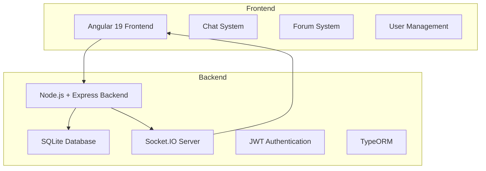
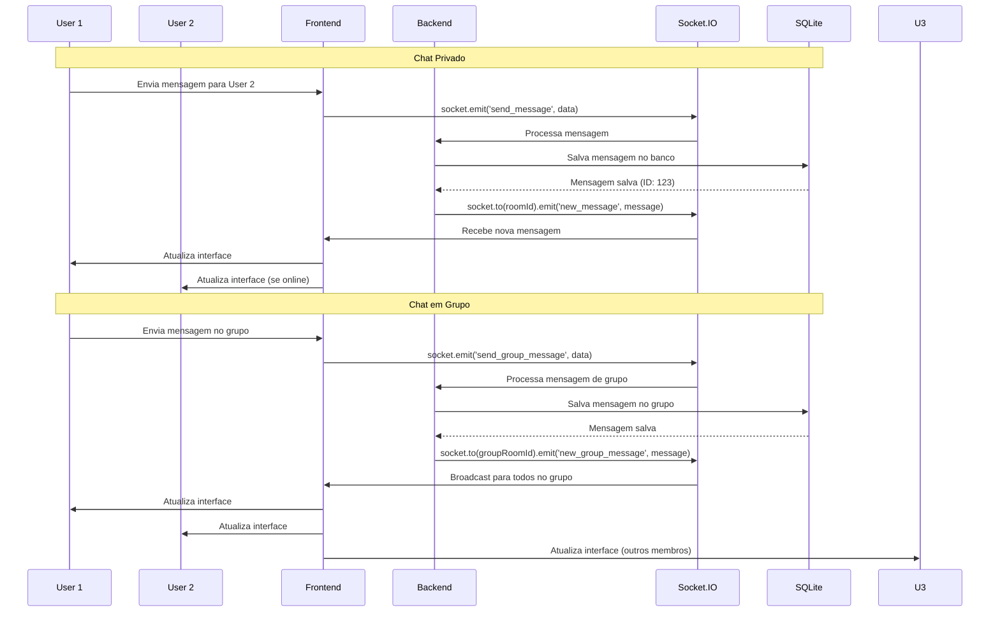
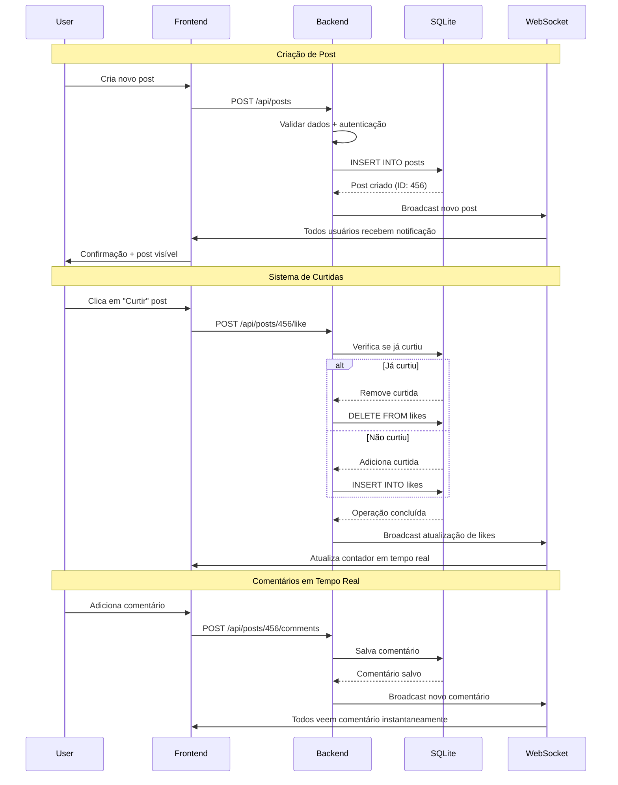
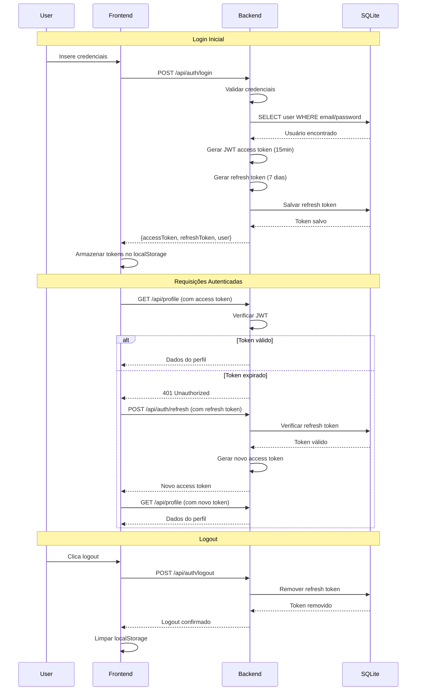
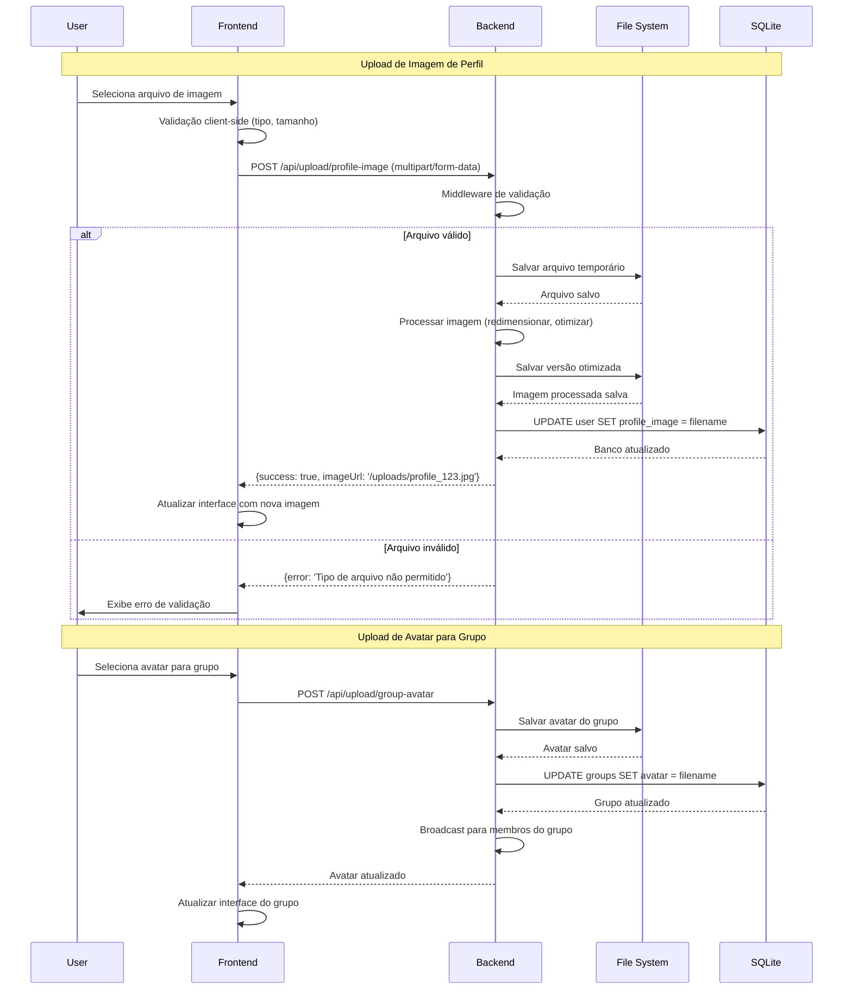

# 🌌 AA Space — Plataforma de Comunidade em Tempo Real

## 🚀 Visão Geral

O **AA Space** é uma plataforma completa de comunidade e comunicação em tempo real, desenvolvida com arquitetura moderna full-stack. A solução oferece um ambiente seguro para compartilhar experiências, com sistema de chat avançado, fórum interativo e gestão de usuários, tudo integrado em uma experiência web responsiva.

### 🎯 Principais Funcionalidades

- **Sistema de Chat Completo**: Conversas privadas e em grupo com controle avançado
- **Fórum Interativo**: Posts, comentários e sistema de curtidas
- **Gestão de Usuários**: Perfis personalizáveis com upload de imagens
- **Comunicação em Tempo Real**: Via WebSockets com Socket.IO
- **Interface Moderna**: Design responsivo com Angular 19
- **Backend Robusto**: API RESTful com Node.js e Express

## 🏗️ Arquitetura do Sistema



## 🔄 Fluxos de Comunicação em Tempo Real

### Sistema de Chat Híbrido (Privado + Grupo)



### Sistema de Fórum Interativo



## 🔐 Sistema de Autenticação e Sessões

### Fluxo JWT com Refresh Tokens



## 🛠️ Stack Tecnológica

### Frontend

- **Angular 19** - Framework enterprise com TypeScript 5.7
- **RxJS 7.8** - Programação reativa
- **Socket.IO Client** - Comunicação WebSocket
- **CSS3** - Interface responsiva e moderna

### Backend

- **Node.js** - Runtime JavaScript server-side
- **Express.js 4.18** - Framework web
- **TypeScript 5.8** - Tipagem estática
- **Socket.IO 4.8** - Servidor WebSocket

### Banco de Dados

- **SQLite3** - Banco relacional embarcado
- **TypeORM 0.3.22** - ORM moderno com TypeScript
- **Migrations** - Controle de versão de schema

### Segurança & Autenticação

- **JWT** - Tokens seguros para autenticação
- **bcrypt** - Criptografia de senhas
- **CORS** - Controle de acesso cross-origin
- **Input Validation** - Validação robusta de dados

### DevOps & Desenvolvimento

- **TypeScript Compiler** - Compilação type-safe
- **ts-node** - Execução TypeScript em desenvolvimento
- **nodemon** - Hot reload
- **Concurrently** - Execução paralela de processos

## 🎯 Funcionalidades Técnicas

### 1. Sistema de Chat Avançado

- **Conversas Privadas**: One-to-one com histórico persistente
- **Chat em Grupo**: Múltiplos participantes com avatares personalizáveis
- **Tempo Real**: Comunicação instantânea via WebSockets
- **Status de Mensagens**: Entrega e leitura em tempo real
- **Gerenciamento de Participantes**: Adicionar/remover usuários

### 2. Sistema de Fórum

- **Posts e Comentários**: Sistema completo de interação
- **Sistema de Curtidas**: Para posts e comentários
- **Atualizações em Tempo Real**: Notificações instantâneas
- **Moderação de Conteúdo**: Controle administrativo

### 3. Gestão de Usuários

- **Autenticação JWT**: Sistema stateless seguro
- **Upload de Imagens**: Fotos de perfil e avatares de grupo
- **Informações de Contato**: Email e telefone
- **Sistema de Roles**: Administradores e usuários comuns

### 4. Sistema de Upload e Gestão de Arquivos

- **Validação de Arquivos**: Tipos e tamanhos permitidos
- **Armazenamento Local**: Integração com sistema de arquivos
- **Processamento de Imagens**: Otimização automática

#### Fluxo de Upload com Validação



## 🔧 Implementações Técnicas

### Comunicação WebSocket

```typescript
// Servidor Socket.IO
io.on('connection', (socket) => {
  socket.on('join_room', (roomId) => {
    socket.join(roomId);
  });
  
  socket.on('send_message', (data) => {
    io.to(data.roomId).emit('new_message', data);
  });
});
```

### Entidades TypeORM

```typescript
@Entity()
export class User {
  @PrimaryGeneratedColumn()
  id: number;
  
  @Column({ unique: true })
  username: string;
  
  @OneToMany(() => ChatMessage, message => message.sender)
  messages: ChatMessage[];
}
```

### Autenticação JWT

```typescript
// Middleware de autenticação
const authenticateToken = (req, res, next) => {
  const token = req.headers['authorization'];
  if (!token) return res.sendStatus(401);
  
  jwt.verify(token, process.env.JWT_SECRET, (err, user) => {
    if (err) return res.sendStatus(403);
    req.user = user;
    next();
  });
};
```

## 📊 Diferenciais Técnicos

### Inovações Implementadas

1. **Sistema de chat híbrido** com conversas privadas e em grupo
2. **Integração WebSocket** para comunicação em tempo real
3. **Arquitetura TypeScript** full-stack com tipagem estática
4. **Sistema de upload** com validação de segurança
5. **Interface responsiva** adaptável para todos os dispositivos

### Skills Demonstradas

- **Full-stack Development** com Angular e Node.js
- **Real-time Communication** com WebSockets
- **TypeScript** em frontend e backend
- **ORM Moderno** com TypeORM
- **Autenticação Segura** com JWT
- **Arquitetura de Componentes** com Angular
- **Programação Reativa** com RxJS
- **Controle de Versão** de banco de dados

## 🚀 Resultado Final

O **AA Space** demonstra capacidade avançada em:

- **Desenvolvimento Full-stack** moderno
- **Comunicação em Tempo Real** com WebSockets
- **Arquitetura TypeScript** type-safe
- **Sistemas de Chat** complexos
- **Gestão de Usuários** e autenticação
- **Interface Responsiva** e moderna

Uma solução completa que integra tecnologias modernas do mercado para criar uma experiência de comunidade robusta e escalável.
