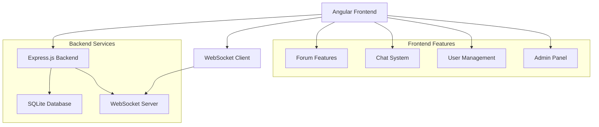

# 🌟 AA Space — Fórum de Apoio e Comunidade

Um fórum seguro e acolhedor para compartilhar experiências e encontrar apoio. Desenvolvido com Angular 19 para o frontend e Node.js com Express para o backend, oferecendo um ambiente completo de comunicação e suporte com sistema de chat em tempo real.

## 🚀 Visão Geral

O **AA Space** é uma plataforma web moderna que combina funcionalidades de fórum tradicional com um sistema avançado de chat em tempo real. Projetado para criar um ambiente seguro e acolhedor onde usuários podem compartilhar experiências, receber apoio e se conectar através de conversas privadas e em grupo.

## 🏗️ Arquitetura Geral do Sistema



### Fluxo Principal do Sistema

```
1. Usuário acessa a aplicação web
2. Sistema de autenticação (login/registro)
3. Acesso ao dashboard principal
4. Navegação entre fórum e chat
5. Interações em tempo real via WebSocket
6. Gerenciamento de perfil e configurações
7. Administração do sistema (usuários admin)
```

## 🏗️ Stack Tecnológica

### Frontend (Angular)

- **Angular 19** com TypeScript
- **Angular Material** para componentes UI
- **RxJS** para programação reativa
- **WebSocket Client** para comunicação em tempo real
- **SCSS** para estilização avançada

### Backend (Node.js/Express)

- **Node.js** com Express.js
- **TypeScript** para tipagem estática
- **TypeORM** para mapeamento objeto-relacional
- **SQLite3** como banco de dados
- **WebSocket (ws)** para comunicação em tempo real
- **JWT** para autenticação segura
- **bcrypt** para hash de senhas
- **CORS** para configuração de origem cruzada

### Infraestrutura & DevOps

- **SQLite** embarcado para simplicidade
- **Migrações automáticas** com TypeORM
- **Hot reload** em desenvolvimento
- **Build otimizado** para produção

## 🎯 Principais Funcionalidades

### 1. Sistema de Fórum

- Criação de posts anônimos ou identificados
- Sistema de comentários em posts
- Curtidas em posts e comentários
- Interface responsiva e intuitiva

#### Fluxo do Fórum

```
1. Usuário acessa seção do fórum
2. Visualiza posts existentes
3. Cria novo post (anônimo ou identificado)
4. Outros usuários comentam e curtem
5. Sistema atualiza em tempo real
6. Histórico de interações mantido
```

### 2. Sistema de Chat Completo

- Conversas privadas entre usuários
- Grupos de chat com múltiplos participantes
- Avatares personalizáveis para grupos
- Status de leitura de mensagens (enviada, entregue, lida)
- Gerenciamento de participantes em grupos

#### Fluxo do Chat

```
1. Usuário inicia conversa privada ou cria grupo
2. Convite de participantes (grupos)
3. Troca de mensagens em tempo real
4. Status de leitura atualizado automaticamente
5. Gerenciamento de administradores (grupos)
6. Histórico de mensagens persistido
```

### 3. Sistema de Usuários e Perfis

- Registro e autenticação segura
- Upload e exibição de imagem de perfil
- Modo convidado com nickname
- Informações de contato (email, telefone)

#### Fluxo de Gestão de Usuários

```
1. Registro de novo usuário
2. Upload de foto de perfil (opcional)
3. Configuração de informações pessoais
4. Ativação de modo convidado
5. Gerenciamento de preferências
6. Controle de privacidade
```

### 4. Painel de Administração

- Gerenciamento de usuários
- Promoção/remoção de administradores
- Transferência de administrador principal
- Controle de acesso e permissões

#### Fluxo de Administração

```
1. Login como administrador
2. Acesso ao painel administrativo
3. Visualização de usuários e atividades
4. Promoção de novos administradores
5. Gerenciamento de permissões
6. Transferência de privilégios especiais
```

### 5. Sistema de Autenticação e Segurança

- Autenticação via JWT
- Hash seguro de senhas com bcrypt
- Validação de tokens
- Controle de sessões

#### Fluxo de Autenticação

```
1. Usuário insere credenciais
2. Validação no backend
3. Verificação de hash da senha
4. Geração de JWT token
5. Armazenamento seguro do token
6. Middleware de validação em rotas protegidas
```

### 6. Banco de Dados e Migrações

- SQLite embarcado para simplicidade
- Migrações automáticas com TypeORM
- Backup e restauração de dados
- Estrutura relacional otimizada

#### Fluxo de Migrações

```
1. Desenvolvimento de nova funcionalidade
2. Criação de migration files
3. Execução automática em desenvolvimento
4. Aplicação em produção via scripts
5. Verificação de integridade
6. Rollback se necessário
```

## 🔧 Sistemas Técnicos de Destaque

### Sistema de Chat em Tempo Real

O sistema de chat é uma das funcionalidades mais avançadas, implementando comunicação WebSocket bidirecional:

#### Arquitetura do Chat

```typescript
// Estrutura de mensagens
interface ChatMessage {
  id: string;
  conversationId: string;
  senderId: string;
  content: string;
  timestamp: Date;
  status: 'sent' | 'delivered' | 'read';
}
```

#### Características Técnicas

- **WebSocket bidirecional**: Comunicação instantânea
- **Status de mensagens**: Controle de entrega e leitura
- **Persistência**: Mensagens salvas no SQLite
- **Escalabilidade**: Suporte a múltiplas conversas simultâneas

### Sistema de Permissões

```typescript
// Estrutura de permissões
interface UserPermissions {
  isAdmin: boolean;
  isMainAdmin: boolean;
  canCreateGroups: boolean;
  canModeratePosts: boolean;
}
```

### Gerenciamento de Grupos

- **Criação de grupos** com avatar personalizado
- **Adição/remoção** de participantes
- **Promoção/rebaixamento** de administradores
- **Controle de permissões** por grupo

## 📊 Banco de Dados

### Principais Entidades

- **User**: Dados dos usuários, credenciais e perfil
- **Post**: Postagens no fórum
- **Comment**: Comentários em posts
- **PostLike/CommentLike**: Sistema de curtidas
- **ChatConversation**: Conversas (privadas e grupos)
- **ChatParticipant**: Participantes em conversas
- **ChatMessage**: Mensagens do chat

### Estrutura Relacional

```sql
-- Principais relacionamentos
User 1:N Post
User 1:N Comment
User 1:N ChatParticipant
Post 1:N Comment
Post 1:N PostLike
ChatConversation 1:N ChatMessage
ChatConversation 1:N ChatParticipant
```

## 🚀 Deploy e Infraestrutura

### Ambientes

- **Desenvolvimento**: Hot reload com ts-node
- **Produção**: Build otimizado com Node.js
- **Banco**: SQLite embarcado (portátil)

### Scripts de Deploy

```bash
# Desenvolvimento
npm run dev

# Build de produção
npm run build

# Execução em produção
npm start

# Migrações
npm run migration:run
```

### Fluxo de Desenvolvimento

#### Setup Inicial

```bash
# Instalação de dependências
npm install
cd server && npm install

# Configuração do banco
npm run migration:run

# Início do desenvolvimento
npm run dev
```

#### Build de Produção

```bash
# Build do frontend
npm run build

# Build do backend
cd server && npm run build

# Início em produção
npm start
```

## 📈 Métricas e Monitoramento

- **Logs estruturados** para debugging
- **Health checks** do sistema
- **Monitoramento de conexões** WebSocket
- **Métricas de performance** do banco

## 🎨 Interface do Usuário

- **Design moderno** com Angular Material
- **Responsivo** para diferentes dispositivos
- **Tema consistente** e acessível
- **Componentes reutilizáveis**
- **Animações suaves** para melhor UX

## 🔮 Inovações Técnicas

1. **Chat Híbrido**: Combinação de fórum + chat em tempo real
2. **Sistema de Status**: Controle avançado de entrega de mensagens
3. **Gerenciamento de Grupos**: Funcionalidades completas de moderação
4. **Upload de Avatares**: Personalização visual para grupos
5. **Modo Convidado**: Acesso sem registro para leitura
6. **Arquitetura Modular**: Separação clara entre frontend e backend
7. **Migrações Automáticas**: Sistema robusto de versionamento de banco

### Destaques do Sistema de Chat

- **Primeira implementação** de status de mensagens em tempo real
- **Gerenciamento avançado** de grupos com avatares
- **Sistema de permissões** granular por conversa
- **Persistência inteligente** com otimização de queries
- **Interface intuitiva** para diferentes tipos de conversa

## 🛠️ Tecnologias de Destaque

- **Angular 19** com TypeScript
- **Node.js/Express** para backend robusto
- **TypeORM** para mapeamento objeto-relacional
- **SQLite** para simplicidade e portabilidade
- **WebSocket** para comunicação em tempo real
- **JWT** para autenticação segura
- **Angular Material** para UI consistente

## 📝 Conclusão

Este projeto demonstra expertise em:

- **Desenvolvimento full-stack moderno** (Angular + Node.js)
- **Sistemas de chat em tempo real** com WebSocket
- **Gerenciamento de usuários** e permissões
- **Interface responsiva** e acessível
- **Arquitetura modular** e escalável
- **Banco de dados relacional** com migrações
- **Sistemas de fórum** e comunicação

O AA Space representa uma solução completa para comunidades online, combinando funcionalidades tradicionais de fórum com comunicação moderna em tempo real, criando um ambiente seguro e acolhedor para troca de experiências e apoio mútuo.

---

**Desenvolvido com ❤️ para criar conexões e oferecer apoio**
