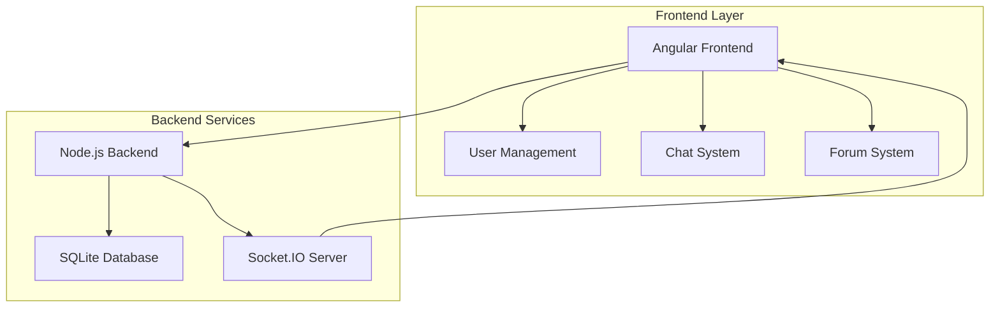

# 🌌 AA Space — Plataforma de Comunidade e Chat em Tempo Real

## 🚀 Visão Geral

O **AA Space** é uma plataforma completa de comunidade e comunicação em tempo real, desenvolvida com arquitetura moderna full-stack. Esta solução oferece um ambiente seguro e acolhedor para compartilhar experiências, com sistema de chat avançado, fórum interativo e gestão de usuários, tudo integrado em uma experiência web responsiva e intuitiva.

### 🎯 Proposta de Valor

- **Sistema de Chat Completo**: Conversas privadas e em grupo com controle avançado
- **Fórum Interativo**: Posts, comentários e sistema de curtidas
- **Gestão de Usuários**: Perfis personalizáveis com upload de imagens
- **Tempo Real**: Comunicação instantânea via WebSockets
- **Interface Moderna**: Design responsivo com Angular 19
- **Backend Robusto**: API RESTful com Node.js e Express

## 🏗️ Arquitetura Geral do Sistema



### Fluxo Principal do Sistema

```text
1. Usuário acessa a aplicação web
2. Sistema de autenticação JWT
3. Interface principal com chat e fórum
4. Comunicação em tempo real via WebSockets
5. Gestão de conversas e posts
6. Upload e gerenciamento de arquivos
7. Notificações em tempo real
```

## 🏗️ Stack Tecnológica Moderna

### Frontend (Angular 19 + TypeScript)

**Framework & Linguagem:**

- **Angular 19** - Framework enterprise mais robusto do mercado
- **TypeScript 5.7** - Tipagem estática para desenvolvimento escalável
- **RxJS 7.8** - Programação reativa (padrão enterprise)

**UI/UX & Estilização:**

- **CSS3** - Estilização moderna e responsiva
- **Responsive Design** - Interface adaptável para diferentes dispositivos
- **Component Architecture** - Arquitetura de componentes reutilizáveis

**Comunicação & Integração:**

- **Socket.IO Client** - Conexão WebSocket para tempo real
- **HTTP Client** - Comunicação REST com backend
- **File Upload** - Sistema de upload de imagens

### Backend (Node.js + Express + TypeScript)

**Tecnologias Core:**

- **Node.js** - Runtime JavaScript server-side líder de mercado
- **Express.js 4.18** - Framework web mais popular do Node.js
- **TypeScript 5.8** - Tipagem estática para desenvolvimento robusto
- **RESTful APIs** - Arquitetura de comunicação padrão

**Banco de Dados & ORM:**

- **SQLite3** - Banco relacional embarcado
- **TypeORM 0.3.22** - ORM moderno com TypeScript
- **Migrations** - Controle de versão de schema
- **Entity Management** - Gerenciamento de entidades

**Segurança & Autenticação:**

- **JWT (jsonwebtoken)** - Tokens seguros para autenticação
- **bcrypt** - Criptografia de senhas
- **CORS** - Controle de acesso cross-origin
- **Input Validation** - Validação robusta de dados

**Comunicação em Tempo Real:**

- **Socket.IO 4.8** - WebSockets bidirecionais
- **WebSocket Server** - Servidor de tempo real
- **Event-driven Architecture** - Arquitetura baseada em eventos

### Infraestrutura & DevOps

**Desenvolvimento & Build:**

- **TypeScript Compiler** - Compilação type-safe
- **ts-node** - Execução TypeScript em desenvolvimento
- **nodemon** - Hot reload para desenvolvimento
- **Concurrently** - Execução paralela de processos

**Qualidade & Monitoramento:**

- **Structured Logging** - Logs organizados
- **Error Handling** - Tratamento robusto de erros
- **Health Checks** - Monitoramento de saúde da aplicação

## 🎯 Principais Funcionalidades

### 1. Sistema de Autenticação e Gestão de Usuários

**Autenticação Segura:**

- **JWT Authentication** - Tokens seguros e stateless
- **Password Encryption** - Criptografia bcrypt
- **User Registration** - Registro de novos usuários
- **Login/Logout** - Sistema de sessão seguro

**Gestão de Perfis:**

- **Profile Pictures** - Upload e exibição de imagens
- **User Information** - Dados pessoais e contato
- **Admin Management** - Sistema de administração
- **Role-based Access** - Controle de permissões

#### Fluxo de Autenticação

```text
1. Usuário registra conta ou faz login
2. Validação de credenciais no backend
3. Geração de JWT token
4. Armazenamento do token no frontend
5. Middleware de autenticação para rotas protegidas
6. Controle de acesso baseado em roles
```

### 2. Sistema de Chat Avançado

**Conversas Privadas:**

- **One-to-One Chat** - Conversas entre dois usuários
- **Real-time Messaging** - Mensagens instantâneas
- **Message Status** - Status de entrega e leitura
- **Message History** - Histórico persistente

**Chat em Grupo:**

- **Group Creation** - Criação de grupos
- **Multiple Participants** - Múltiplos usuários
- **Group Avatars** - Avatares personalizados para grupos
- **Admin Controls** - Controle de administradores

**Recursos Avançados:**

- **Message Broadcasting** - Broadcast para todos os participantes
- **Participant Management** - Adicionar/remover participantes
- **Group Permissions** - Controle de permissões em grupos
- **Real-time Updates** - Atualizações instantâneas

#### Fluxo do Sistema de Chat

```text
1. Usuário inicia conversa privada ou grupo
2. Criação de canal de comunicação
3. Adição de participantes
4. Troca de mensagens em tempo real
5. Persistência no banco de dados
6. Notificações para usuários offline
```

### 3. Sistema de Fórum Interativo

**Posts e Comentários:**

- **Post Creation** - Criação de posts públicos
- **Comment System** - Sistema de comentários
- **Like/Unlike** - Sistema de curtidas
- **Post Categories** - Categorização de conteúdo

**Interatividade:**

- **Real-time Updates** - Atualizações em tempo real
- **User Engagement** - Sistema de engajamento
- **Content Moderation** - Moderação de conteúdo
- **Search Functionality** - Busca de posts e comentários

#### Fluxo do Fórum

```text
1. Usuário cria post ou comentário
2. Validação e persistência no banco
3. Broadcast para todos os usuários online
4. Atualização da interface em tempo real
5. Sistema de curtidas e interações
6. Histórico e busca de conteúdo
```

### 4. Sistema de Upload e Gerenciamento de Arquivos

**Upload de Imagens:**

- **Profile Pictures** - Upload de fotos de perfil
- **Group Avatars** - Avatares para grupos
- **File Validation** - Validação de tipos de arquivo
- **Storage Management** - Gerenciamento de armazenamento

**Recursos Técnicos:**

- **File System Integration** - Integração com sistema de arquivos
- **Image Processing** - Processamento de imagens
- **Storage Optimization** - Otimização de armazenamento
- **Security Validation** - Validação de segurança

## 🔧 Sistemas Técnicos de Destaque

### Arquitetura de Comunicação em Tempo Real

**Socket.IO Implementation:**

```typescript
// Servidor WebSocket
io.on('connection', (socket) => {
  socket.on('join_room', (roomId) => {
    socket.join(roomId);
  });
  
  socket.on('send_message', (data) => {
    io.to(data.roomId).emit('new_message', data);
  });
});
```

**Características Técnicas:**

- **Room Management** - Gerenciamento de salas de chat
- **Event-driven** - Arquitetura baseada em eventos
- **Scalable** - Suporte a múltiplas conexões
- **Reliable** - Reconexão automática

### Sistema de Banco de Dados com TypeORM

**Entity Management:**

```typescript
@Entity()
export class User {
  @PrimaryGeneratedColumn()
  id: number;
  
  @Column({ unique: true })
  username: string;
  
  @Column()
  email: string;
  
  @OneToMany(() => ChatMessage, message => message.sender)
  messages: ChatMessage[];
}
```

**Características:**

- **Type Safety** - Tipagem estática com TypeScript
- **Migrations** - Controle de versão de schema
- **Relationships** - Relacionamentos entre entidades
- **Query Builder** - Construtor de queries type-safe

### Sistema de Autenticação JWT

**Token Management:**

```typescript
// Geração de token
const token = jwt.sign(
  { userId: user.id, username: user.username },
  process.env.JWT_SECRET,
  { expiresIn: '24h' }
);

// Middleware de autenticação
const authenticateToken = (req, res, next) => {
  const token = req.headers['authorization'];
  if (!token) return res.sendStatus(401);
  
  jwt.verify(token, process.env.JWT_SECRET, (err, user) => {
    if (err) return res.sendStatus(403);
    req.user = user;
    next();
  });
};
```

## 🛠️ Skills Técnicas Demonstradas

### Frontend Development (Modern)

- **Angular 19** - Framework enterprise líder de mercado
- **TypeScript** - Linguagem moderna com tipagem estática
- **RxJS** - Programação reativa (essencial para apps complexos)
- **Socket.IO Client** - Comunicação em tempo real
- **Responsive Design** - UX adaptável para todos os dispositivos

### Backend Development (Node.js)

- **Node.js + Express** - Stack JavaScript server-side líder
- **TypeScript** - Tipagem estática para desenvolvimento robusto
- **TypeORM** - ORM moderno com TypeScript
- **JWT Authentication** - Autenticação stateless
- **Socket.IO Server** - Servidor WebSocket

### Database & Persistence

- **SQLite3** - Banco relacional embarcado
- **TypeORM** - ORM com TypeScript
- **Migrations** - Controle de versão de schema
- **Entity Relationships** - Relacionamentos complexos

### Real-time Communication

- **WebSockets** - Comunicação bidirecional
- **Socket.IO** - Framework WebSocket mais popular
- **Event-driven Architecture** - Arquitetura baseada em eventos
- **Room Management** - Gerenciamento de salas

### Security & Authentication

- **JWT** - Tokens seguros para autenticação
- **bcrypt** - Criptografia de senhas
- **CORS** - Controle de acesso cross-origin
- **Input Validation** - Validação de dados

## 📊 Impacto & Resultados

### Inovações Implementadas

1. **Sistema de chat híbrido** com conversas privadas e em grupo
2. **Integração WebSocket** para comunicação em tempo real
3. **Sistema de upload** de imagens com validação
4. **Arquitetura TypeScript** full-stack
5. **Sistema de fórum** interativo com curtidas

### Tecnologias Modernas Utilizadas

- **Angular 19** - Framework frontend enterprise
- **Node.js + Express** - Stack JavaScript server-side
- **TypeScript** - Linguagem moderna com tipagem
- **SQLite + TypeORM** - Persistência de dados
- **Socket.IO** - Comunicação em tempo real

### Diferenciais Competitivos

- **Comunicação em tempo real** com WebSockets
- **Interface moderna** com Angular
- **Sistema de chat avançado** com grupos
- **Upload de arquivos** integrado
- **Arquitetura type-safe** com TypeScript

## 📝 Conclusão

Este projeto demonstra expertise avançada em:

### Arquitetura & Design

- **Full-stack TypeScript** com tipagem estática
- **Real-time communication** com WebSockets
- **Event-driven architecture** baseada em eventos
- **Component-based design** com Angular

### Integração & APIs

- **RESTful APIs** com Express
- **WebSocket communication** com Socket.IO
- **JWT Authentication** stateless
- **File upload** e gerenciamento

### Persistência de Dados

- **TypeORM** com TypeScript
- **SQLite** para desenvolvimento e produção
- **Migrations** para controle de schema
- **Entity relationships** complexas

### User Experience

- **Real-time updates** para melhor UX
- **Responsive design** para todos os dispositivos
- **Interactive features** como chat e fórum
- **File management** integrado

O **AA Space** representa uma solução completa de comunidade que demonstra capacidade de criar sistemas de comunicação em tempo real, integrar tecnologias modernas e implementar arquiteturas full-stack robustas com foco na experiência do usuário.

---

## Desenvolvido com foco em comunicação, interatividade e experiência do usuário
