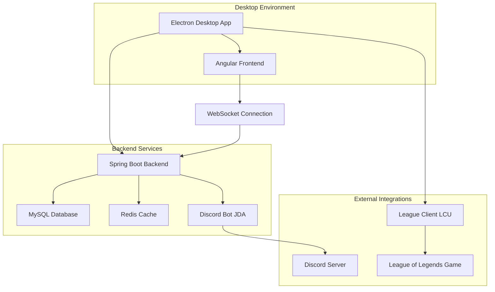

# 🎮 LOL Matchmaking System

Um sistema completo de matchmaking personalizado para League of Legends, desenvolvido com arquitetura moderna e tecnologias de ponta.

## 🚀 Visão Geral

O **LOL Matchmaking System** é uma plataforma desktop que simula o sistema de filas do League of Legends, permitindo que jogadores criem partidas customizadas, realizem drafts completos e gerenciem partidas com integração total ao jogo via LCU (League Client Update).

## 🏗️ Arquitetura Geral do Sistema



### Fluxo Principal do Sistema

```
1. Usuário abre aplicação Electron
2. Electron inicia backend Spring Boot
3. Frontend Angular conecta via WebSocket
4. Usuário faz login e entra na fila
5. Sistema forma partidas via algoritmo de matchmaking
6. Draft é executado com validação LCU
7. Partida é monitorada em tempo real
8. Resultado é capturado e votado
9. Estatísticas são atualizadas
```

## 🏗️ Stack Tecnológica

### Backend (Spring Boot)

- **Java 21** com Spring Boot 3.3.2
- **Spring Data JPA** para persistência
- **MySQL** como banco principal + **H2** para desenvolvimento
- **Redis** para cache e gerenciamento de estado em tempo real
- **WebSockets** para comunicação em tempo real
- **Liquibase** para migrações de banco
- **Redisson** para distributed locks
- **MapStruct** para mapeamento de objetos
- **Lombok** para redução de boilerplate
- **Discord Integration** para integração com Discord

### Frontend (Angular)

- **Angular 20** com TypeScript
- **RxJS** para programação reativa
- **SCSS** para estilização
- **Socket.IO Client** para WebSockets

### Desktop (Electron)

- **Electron 28** para aplicação desktop
- **TypeScript** no processo principal
- **WebSocket** para comunicação com backend
- **LCU Integration** para integração com League of Legends

### Infraestrutura & DevOps

- **Docker** e **Docker Compose** para containerização
- **Google Cloud Run** para deploy
- **Kubernetes** (manifests incluídos)
- **Redis** standalone para produção
- **Maven** para build e gerenciamento de dependências

## 🎯 Principais Funcionalidades

### 1. Sistema de Matchmaking

- **Fila inteligente** com balanceamento automático de MMR
- **Algoritmo de formação de times** baseado em elo e disponibilidade
- **Sistema de LP (League Points)** customizado
- **Integração com Discord** para notificações e gerenciamento de usuários

#### Fluxo do Matchmaking

```
1. Jogador entra na fila → Validação via LCU
2. Sistema busca jogadores compatíveis por MMR
3. Formação de times balanceados (5v5)
4. Criação automática de canais Discord
5. Notificação para todos os jogadores
6. Início do processo de draft
```

### 2. Sistema de Draft Avançado

- **Draft completo** com picks e bans
- **Timer sincronizado** entre todos os jogadores
- **Validação em tempo real** via Electron/LCU
- **Persistência de estado** no Redis para alta disponibilidade
- **Sistema de confirmações** com locks distribuídos

#### Fluxo do Draft

```
1. Confirmação de todos os jogadores (30s)
2. Fase de Bans (3 bans por time, 30s cada)
3. Fase de Picks (5 picks por time, 30s cada)
4. Validação final via LCU
5. Início da partida no League of Legends
6. Monitoramento automático do resultado
```

### 3. Integração com League of Legends

- **LCU Integration** para detecção automática de jogadores
- **Validação de ações** via cliente do jogo
- **Monitoramento de partidas** em tempo real
- **Linking automático** de resultados

#### Fluxo de Integração LCU

```
1. Detecção automática do cliente do LoL
2. Validação de identidade do jogador
3. Monitoramento de ações no jogo
4. Captura automática de resultados
5. Atualização de estatísticas e LP
```

### 4. Automação Avançada do Discord

- **Criação automática de canais** dedicados para cada partida
- **Sistema de mute/unmute** de espectadores pelos jogadores
- **Gestão inteligente de permissões** nos canais de voz
- **Limpeza automática** de canais após partidas
- **Integração completa** com servidor Discord via JDA

#### Fluxo de Automação Discord

```
1. Partida criada → Criação automática de canais de voz
2. Separação de times em canais específicos
3. Canal de espectadores com controles de mute
4. Movimentação automática durante draft/partida
5. Limpeza automática após 2 horas (TTL)
```

### 5. Sistema de Votação e Resultados

- **Votação democrática** para resultados de partidas
- **Sistema de integridade** com validação múltipla
- **Histórico completo** de partidas e estatísticas
- **Leaderboards** e rankings

#### Fluxo de Votação

```
1. Partida finalizada → Sistema solicita votação
2. Todos os jogadores votam no resultado
3. Validação de integridade (maioria simples)
4. Atualização de MMR e LP
5. Registro no histórico de partidas
```

### 6. Funcionalidades Avançadas

- **Multi-backend sync** para alta disponibilidade
- **Sistema de cache** com Caffeine
- **Retry automático** com Resilience4j
- **Logs estruturados** com SLF4J
- **Health checks** e métricas

## 🔧 Sistemas Técnicos de Destaque

### Sistema de Draft

O sistema de draft é uma das funcionalidades mais complexas e inovadoras do projeto:

### Arquitetura do Draft

```java
// Fluxo principal do draft
QueueManagementService → MatchFoundService → DraftFlowService → GameInProgressService
```

### Características Técnicas

- **Redis como estado central**: Operações atômicas para confirmações e timers
- **Distributed locks**: Prevenção de ações simultâneas
- **TTL automático**: Limpeza automática de dados temporários
- **Validação via Electron**: Todas as ações são validadas via LCU
- **WebSockets**: Sincronização em tempo real entre todos os clientes

### Operações Atômicas

```java
// Confirmações instantâneas via Redis Sets
redisTemplate.opsForSet().add(key, summonerName); // O(1)
Long count = redisTemplate.opsForSet().size(key); // O(1)

// Timer thread-safe
Long newValue = redisTemplate.opsForValue().decrement(key); // Atômico
```

### Sistema de Automação Discord

O sistema de automação do Discord é uma das funcionalidades mais avançadas, oferecendo integração completa com servidores Discord:

### Criação Automática de Canais

```java
// Criação automática de canais dedicados para cada partida
public void createMatchVoiceChannel(String matchId, List<String> playerNames) {
    String channelName = "Partida-" + matchId;
    // Criação via JDA (Java Discord API)
    VoiceChannel channel = guild.createVoiceChannel(channelName)
        .setParent(category)
        .queue();
}
```

### Sistema de Mute/Unmute de Espectadores

```java
// Jogadores podem mutar/desmutar espectadores durante partidas
public boolean muteSpectator(Long matchId, String discordId) {
    Member member = guild.getMemberById(discordId);
    member.mute(true).queue(success -> {
        // Atualizar estado no Redis
        redisSpectator.markAsMuted(matchId, discordId);
        // Broadcast para todos os jogadores
        broadcastSpectatorUpdate(matchId);
    });
}
```

### Gestão Inteligente de Permissões

- **Canais dedicados** criados automaticamente para cada partida
- **Permissões específicas** para jogadores e espectadores
- **Movimentação automática** de jogadores entre canais
- **Limpeza automática** após conclusão da partida (TTL de 2 horas)

### Integração com Redis

```java
// Estado persistente de canais Discord no Redis
- discord:match:{matchId}:category → String categoryId
- discord:match:{matchId}:channels:blue → String channelId  
- discord:match:{matchId}:channels:red → String channelId
- discord:match:{matchId}:players:blue → Set<String> discordIds
- discord:match:{matchId}:players:red → Set<String> discordIds
```

## 🛡️ Segurança e Validação

### Sistema de Validação de Ações

Todas as ações críticas são validadas via Electron/LCU:

- ✅ **Aceitar/Recusar partidas**
- ✅ **Picks e bans no draft**
- ✅ **Votação de resultados**
- ✅ **Entrada/saída da fila**

### Fluxo de Segurança

1. Frontend solicita ação
2. Electron valida via LCU
3. Ação enviada para backend
4. Backend processa com confiança total

## 📊 Banco de Dados

### Principais Entidades

- **Players**: Dados dos jogadores (MMR, estatísticas, etc.)
- **Custom Matches**: Partidas criadas
- **Queue Players**: Estado da fila
- **Match Votes**: Sistema de votação
- **Discord Links**: Integração Discord

### Migrações

Sistema robusto de migrações com Liquibase, incluindo:

- Baseline schema
- Sistema de votação
- Integração LCU
- Estatísticas de jogadores

## 🚀 Deploy e Infraestrutura

### Ambientes

- **Local**: Docker Compose com Redis local
- **Desenvolvimento**: H2 em memória
- **Produção**: Google Cloud Run + MySQL + Redis

### Scripts de Deploy

- Build completo com Maven + npm
- Deploy automatizado para Cloud Run
- Scripts de limpeza e manutenção

### Fluxo de Desenvolvimento

#### Build

```bash
| Build completo (Frontend + Backend) |
mvn clean package

| Build apenas frontend |
cd frontend && npm run build:prod

| Build Electron |
npm run build:electron
```

#### Execução Local

```bash
| Backend |
mvn spring-boot:run

| Frontend (desenvolvimento) |
cd frontend && npm start

| Electron |
npm run electron:dev
```

### 📈 Métricas e Monitoramento

- **Health checks** via Spring Actuator
- **Logs estruturados** com diferentes níveis
- **Métricas de performance** do Redis
- **Monitoramento de conexões** WebSocket

### 🎨 Interface do Usuário

- **Design moderno** com SCSS
- **Responsivo** para diferentes resoluções
- **Animações suaves** para feedback visual
- **Tema consistente** com variáveis CSS
- **Componentes reutilizáveis** em Angular

### 🔮 Inovações Técnicas

1. **Sistema de Draft Distribuído**: Primeiro sistema de draft customizado com Redis
2. **Validação via LCU**: Integração única com cliente do League of Legends
3. **Automação Discord Avançada**: Criação automática de canais e gestão de espectadores
4. **Sistema de Mute/Unmute Distribuído**: Controle de espectadores via Redis + JDA
5. **Multi-backend Sync**: Sistema tolerante a falhas
6. **Arquitetura Híbrida**: Desktop + Web com Electron
7. **Cache Inteligente**: Múltiplas camadas de cache (Caffeine + Redis)

### Destaques da Automação Discord

- **Primeira implementação** de mute/unmute de espectadores por jogadores
- **Criação automática** de canais dedicados para cada partida
- **Gestão de permissões** em tempo real via JDA
- **Limpeza inteligente** com TTL automático no Redis
- **Broadcast em tempo real** de mudanças de estado

### 🛠️ Tecnologias de Destaque

- **Spring Boot 3.3.2** com Java 21
- **Angular 20** com programação reativa
- **Redis** para alta performance
- **Electron** para desktop
- **Docker** para containerização
- **WebSockets** para tempo real
- **JDA (Java Discord API)** para integração Discord
- **Discord Bot** com slash commands e automação

### 📝 Conclusão

Este projeto demonstra expertise em:

- **Arquitetura de sistemas complexos**
- **Integração com APIs externas** (Discord, Riot Games)
- **Desenvolvimento full-stack moderno**
- **Sistemas distribuídos e cache**
- **Aplicações desktop com Electron**
- **Automação de bots Discord** com JDA
- **Gestão de permissões** e canais Discord
- **DevOps e deploy em nuvem**

O LOL Matchmaking System representa uma solução completa e inovadora para matchmaking personalizado, combinando tecnologias modernas com funcionalidades avançadas de integração e validação.

---

**Desenvolvido com ❤️ para a comunidade League of Legends**
